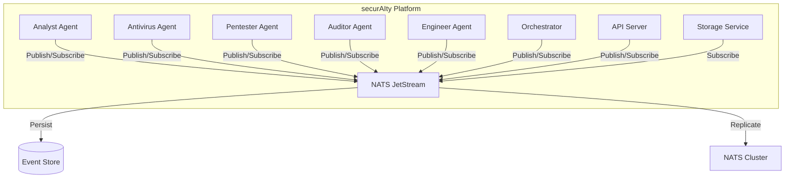

# ADR-001: Event-Driven Architecture with NATS

**Date**: 2026-03-26  
**Status**: Accepted  
**Authors**: securAIty Team  

## Context

The securAIty platform requires a distributed communication mechanism for security events across multiple agents, services, and components. The system needs to handle:

- High-throughput security event streaming (1000+ events/second)
- Asynchronous communication between decoupled components
- Event persistence for audit and compliance requirements
- Support for both pub/sub and request-response patterns
- Reliable delivery with at-least-once semantics
- Low latency for real-time threat detection

### Requirements

1. **Distributed Communication**: Multiple agents need to publish and subscribe to security events
2. **Event Persistence**: Security events must be stored for audit trails and forensic analysis
3. **Scalability**: System must scale horizontally with additional agents and services
4. **Reliability**: No event loss during network partitions or service failures
5. **Performance**: Sub-millisecond latency for event delivery
6. **Python Support**: First-class Python client libraries

## Decision

We will use **NATS with JetStream** as the event bus for all distributed communication within securAIty.

### Architecture



### Configuration

**NATS Server Configuration:**
```conf
# nats.conf
port: 4222
http_port: 8222

jetstream {
  max_mem_store: 4GB
  max_file_store: 100GB
  store_dir: /data/nats
}

cluster {
  name: security-cluster
  port: 6222
  routes: [
    nats://nats-1:6222
    nats://nats-2:6222
    nats://nats-3:6222
  ]
}
```

**Stream Configuration:**
```python
stream_config = StreamConfig(
    name="SECURITY_EVENTS",
    subjects=["security.*"],
    storage=StorageType.FILE,  # Persistent storage
    retention=RetentionPolicy.LIMITS,
    max_msgs_per_subject=100000,
    max_age=86400 * 7,  # 7 days retention
    replicas=3,  # High availability
    acks="all",  # Wait for all replicas
)
```

### Event Subject Naming Convention

```
security.{domain}.{action}.{status}

Examples:
- security.threat.detected.critical
- security.scan.completed.success
- security.incident.created.high
- security.policy.violation.warning
```

## Consequences

### Positive

1. **Lightweight**: NATS server is a single binary with minimal resource footprint (<50MB RAM)
2. **Async-First**: Native async Python client (`nats-py`) with asyncio support
3. **JetStream Persistence**: Built-in streaming with durability guarantees
4. **High Performance**: Benchmarked at 4M+ messages/second with sub-millisecond latency
5. **Simple API**: Clean pub/sub API reduces cognitive load
6. **Cloud Native**: Kubernetes-native with official operators available
7. **Observability**: Built-in monitoring endpoints (HTTP port 8222)

### Trade-offs

1. **Learning Curve**: Team requires training on NATS concepts (streams, consumers, acks)
2. **Operational Complexity**: Running NATS cluster requires operational expertise
3. **Limited Querying**: NATS is not a database; complex queries require external storage
4. **Message Size Limits**: Default 1MB message size limit (configurable but not recommended)

### Negative

1. **Additional Infrastructure**: Requires running and maintaining NATS servers
2. **Event Schema Evolution**: Need to implement schema versioning strategy
3. **Debugging Complexity**: Distributed event flows harder to trace than synchronous calls

## Alternatives Considered

### Apache Kafka

**Pros:**
- Mature ecosystem with extensive tooling
- Strong ordering guarantees
- Massive throughput (billions of messages/day)

**Cons:**
- Heavy operational overhead (Zookeeper dependency)
- Higher latency (10-100ms vs <1ms for NATS)
- Overkill for our scale requirements
- Java-based, less Python-friendly

**Verdict**: Too heavy for our use case; NATS provides sufficient throughput with simpler operations.

### RabbitMQ

**Pros:**
- Mature AMQP implementation
- Rich routing capabilities
- Excellent management UI

**Cons:**
- Higher memory footprint
- Complex clustering setup
- Not optimized for high-throughput streaming
- JetStream provides similar features with simpler architecture

**Verdict**: NATS JetStream offers similar features with better performance and simpler operations.

### Redis Streams

**Pros:**
- Simple deployment (single binary)
- Low latency
- Familiar technology stack

**Cons:**
- Not designed for event streaming at scale
- Limited consumer group functionality
- No built-in schema validation
- Weaker durability guarantees

**Verdict**: Insufficient for security event requirements; NATS provides better durability and streaming semantics.

## Compliance Considerations

For security audit requirements:

1. **Event Immutability**: JetStream with `max_age` ensures events cannot be modified
2. **Retention Policy**: 7-day minimum retention meets compliance requirements
3. **Replication**: 3 replicas ensure data durability
4. **Access Control**: NATS 2.0+ supports JWT-based authentication

## Monitoring

Key metrics to monitor:

```prometheus
# NATS Server Metrics
nats_server_connections
nats_server_subscriptions
nats_server_messages_sent
nats_server_messages_received

# JetStream Metrics
nats_jetstream_stream_messages
nats_jetstream_stream_bytes
nats_jetstream_consumer_pending_messages
nats_jetstream_consumer_ack_floor
```

## References

- [NATS Documentation](https://docs.nats.io/)
- [JetStream Documentation](https://docs.nats.io/nats-server/nats_jetstream)
- [nats-py Client](https://github.com/nats-io/nats.py)
- [NATS Performance Benchmarks](https://docs.nats.io/reference/reference-protocols/nats_benchmarks)

---

**Last Updated**: March 26, 2026
