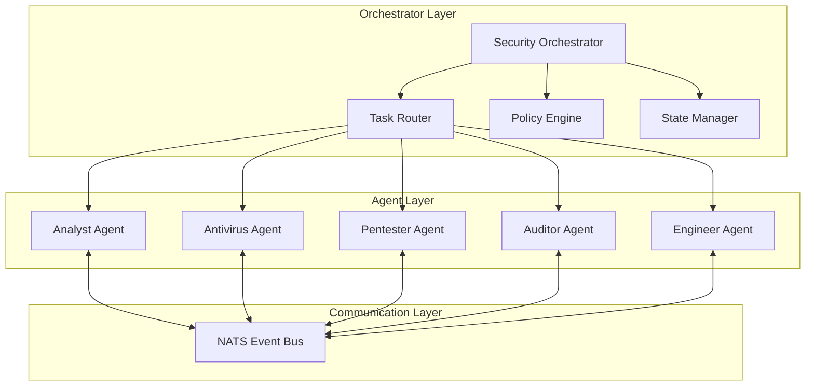
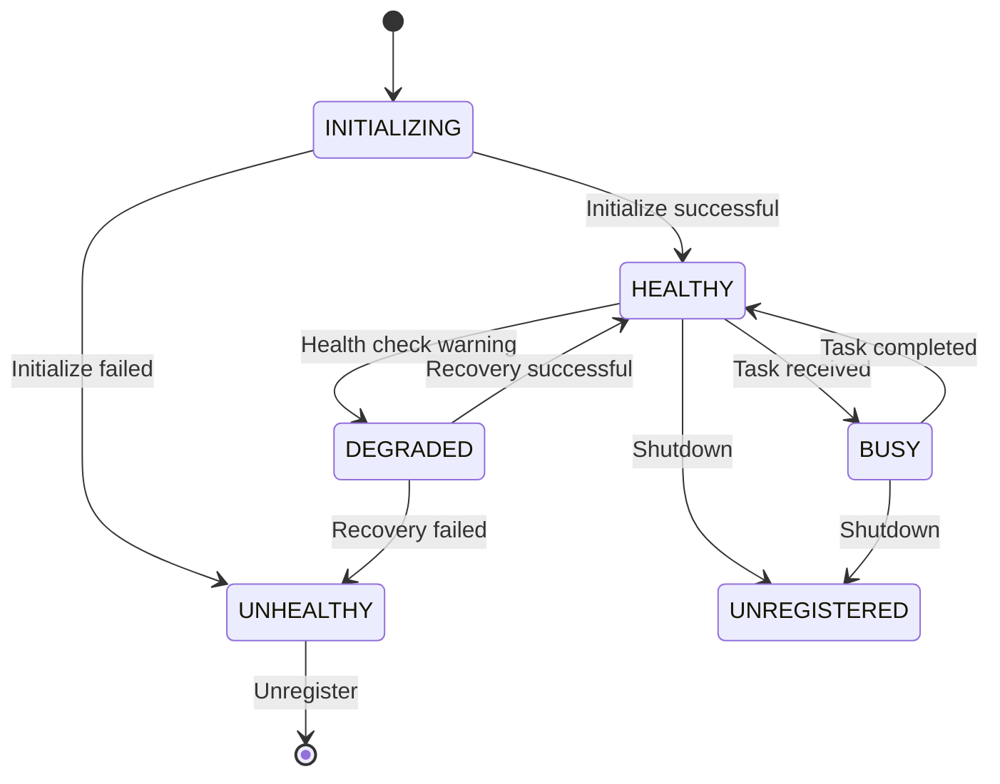

# ADR-002: Multi-Agent Security Orchestration

**Author:** CertifiedSlop

**Date**: 2026-03-26  
**Status**: Accepted  
**Authors**: securAIty Team  

## Context

The securAIty platform requires coordination of multiple specialized security capabilities. A monolithic security service would be difficult to maintain, scale, and extend. We need an architecture that enables:

- Specialized agents with distinct security capabilities
- Dynamic task routing based on agent capabilities
- Coordinated workflows across multiple agents
- Independent scaling of agent instances
- Fault isolation between security functions

### Agent Types

The platform requires five specialized agents:

1. **Analyst Agent**: Threat analysis, event correlation, incident investigation
2. **Antivirus Agent**: Malware detection, file scanning, YARA rules
3. **Pentester Agent**: Vulnerability assessment, penetration testing
4. **Auditor Agent**: Compliance checking, policy enforcement, audit logging
5. **Engineer Agent**: Incident response, automated remediation, containment

### Requirements

1. **Modularity**: Each agent should be independently developable and deployable
2. **Scalability**: Agents should scale based on workload
3. **Resilience**: Agent failures should not cascade
4. **Flexibility**: Support multiple orchestration patterns
5. **Observability**: Track agent health and task execution

## Decision

We will implement a **Multi-Agent Security Orchestration** pattern with specialized agents coordinated by a central orchestrator using capability-based task routing.

### Architecture



### Agent Lifecycle



### Orchestration Patterns

We support five orchestration patterns for different security workflows:

#### 1. Sequential Pattern
Tasks execute in order, with output from one task feeding into the next.

```python
workflow = SequentialWorkflow(
    tasks=[
        {"agent_id": "analyst", "capability": "event_analysis"},
        {"agent_id": "antivirus", "capability": "scan_file"},
        {"agent_id": "engineer", "capability": "contain_threat"},
    ]
)
```

#### 2. Concurrent Pattern
Tasks execute in parallel for independent operations.

```python
workflow = ConcurrentWorkflow(
    tasks=[
        {"agent_id": "pentester", "capability": "vulnerability_scan"},
        {"agent_id": "auditor", "capability": "compliance_check"},
        {"agent_id": "analyst", "capability": "log_analysis"},
    ]
)
```

#### 3. Handoff Pattern
Dynamic handoff between agents based on task requirements.

```python
workflow = HandoffWorkflow(
    initial_agent="analyst",
    handoff_rules={
        "malware_detected": "antivirus",
        "vulnerability_found": "pentester",
        "policy_violation": "auditor",
        "threat_contained": "engineer",
    }
)
```

#### 4. Group Chat Pattern
Multiple agents collaborate on complex investigations.

```python
workflow = GroupChatWorkflow(
    participants=["analyst", "pentester", "auditor"],
    moderator="orchestrator",
    max_rounds=10
)
```

#### 5. Magentic Pattern
Plan-build-execute with dynamic task decomposition.

```python
workflow = MagenticWorkflow(
    planner="analyst",
    builders=["antivirus", "pentester"],
    executor="engineer"
)
```

### Agent Configuration

```python
@dataclass
class AgentConfig:
    agent_id: str
    name: str
    description: str
    capabilities: list[CapabilityConfig]
    max_concurrent_tasks: int = 5
    task_timeout: float = 300.0
    health_check_interval: float = 30.0
```

### Task Router

The Task Router uses capability-based routing:

```python
class TaskRouter:
    def route(self, task: Task) -> Agent:
        """Route task to appropriate agent based on capabilities."""
        required_capability = task.capability
        
        for agent in self.agents:
            if agent.has_capability(required_capability):
                if agent.is_available():
                    return agent
        
        raise NoAvailableAgentError(
            f"No available agent with capability: {required_capability}"
        )
```

## Consequences

### Positive

1. **Modularity**: Each agent can be developed, tested, and deployed independently
2. **Scalability**: Agents scale independently based on workload
3. **Fault Isolation**: Agent failures are contained and don't cascade
4. **Flexibility**: Multiple orchestration patterns support diverse workflows
5. **Specialization**: Each agent focuses on specific security domain
6. **Testability**: Agents can be tested in isolation
7. **Extensibility**: New agents can be added without modifying existing code

### Trade-offs

1. **Complexity**: Multi-agent coordination adds architectural complexity
2. **Latency**: Inter-agent communication adds overhead vs monolithic design
3. **State Management**: Distributed state requires careful management
4. **Debugging**: Tracing across multiple agents is more complex

### Negative

1. **Resource Overhead**: Each agent requires separate resources
2. **Network Dependency**: Agents depend on NATS for communication
3. **Version Compatibility**: Agent versions must be managed carefully

## Agent Interfaces

### Base Agent Interface

All agents must implement:

```python
class BaseAgent(ABC):
    @abstractmethod
    async def initialize(self) -> None:
        """Initialize agent resources."""
        pass

    @abstractmethod
    async def execute(self, request: TaskRequest) -> TaskResult:
        """Execute task and return result."""
        pass

    @abstractmethod
    async def health_check(self) -> HealthStatus:
        """Perform health check."""
        pass

    @abstractmethod
    async def shutdown(self) -> None:
        """Gracefully shutdown agent."""
        pass
```

### Agent Capabilities

Each agent registers capabilities:

```python
capabilities = [
    {
        "name": "scan_file",
        "description": "Scan file for malware",
        "input_schema": {"file_path": "string"},
        "output_schema": {"status": "string", "threats": "array"},
        "timeout": 30.0
    }
]
```

## Health Monitoring

Agents report health status:

```python
class HealthStatus(str, Enum):
    HEALTHY = "healthy"       # Fully operational
    DEGRADED = "degraded"     # Partial functionality
    UNHEALTHY = "unhealthy"   # Cannot perform tasks
    BUSY = "busy"            # Processing tasks
    MAINTENANCE = "maintenance"  # Scheduled maintenance
```

### Health Check Endpoint

```http
GET /api/v1/agents/{agent_id}/health

Response:
{
  "agent_id": "antivirus_001",
  "status": "healthy",
  "last_heartbeat": "2026-03-26T10:30:00Z",
  "cpu_usage": 25.5,
  "memory_usage": 45.2,
  "active_tasks": 3,
  "health_score": 95.0,
  "is_responsive": true
}
```

## Error Handling

### Agent Failures

```python
try:
    result = await agent.execute(task)
except AgentTimeoutError:
    # Retry with different agent
    agent = task_router.get_backup_agent(task.capability)
    result = await agent.execute(task)
except AgentUnavailableError:
    # Queue task for later
    await task_queue.enqueue(task)
```

### Circuit Breaker Pattern

```python
@dataclass
class CircuitBreaker:
    failure_threshold: int = 5
    recovery_timeout: float = 60.0
    
    async def call(self, agent: Agent, task: Task):
        if self.state == OPEN:
            if time_since_failure > self.recovery_timeout:
                self.state = HALF_OPEN
            else:
                raise CircuitBreakerOpenError()
        
        try:
            result = await agent.execute(task)
            self.on_success()
            return result
        except Exception:
            self.on_failure()
            raise
```

## Alternatives Considered

### Single Monolithic Security Service

**Pros:**
- Simpler deployment
- Lower latency (no network calls)
- Easier debugging

**Cons:**
- Single point of failure
- Difficult to scale specific capabilities
- Tight coupling between security functions
- Harder to maintain and extend

**Verdict**: Does not meet scalability and modularity requirements.

### Microservices per Agent

**Pros:**
- Maximum isolation
- Independent deployment
- Technology heterogeneity

**Cons:**
- High operational overhead
- Complex service discovery
- Network latency for all operations
- Requires full microservices infrastructure

**Verdict**: Too much overhead for initial implementation; can evolve to this later.

### Serverless Functions

**Pros:**
- Automatic scaling
- Pay-per-execution
- No infrastructure management

**Cons:**
- Cold start latency
- Limited execution time
- State management complexity
- Vendor lock-in concerns

**Verdict**: Not suitable for long-running security operations.

## Implementation Notes

### Agent Registration

```python
orchestrator.register_agent(analyst_agent)
orchestrator.register_agent(antivirus_agent)
orchestrator.register_agent(pentester_agent)
orchestrator.register_agent(auditor_agent)
orchestrator.register_agent(engineer_agent)
```

### Workflow Execution

```python
workflow_state = await orchestrator.execute_workflow(
    workflow_id="incident_response_001",
    tasks=[
        {"agent_id": "analyst", "input": {"event_id": "evt_123"}},
        {"agent_id": "antivirus", "input": {"file_path": "/tmp/suspicious.exe"}},
        {"agent_id": "engineer", "input": {"action": "contain", "threat_id": "threat_456"}},
    ],
    initial_context={"incident_id": "inc_789"}
)
```

## References

- [Multi-Agent Systems Patterns](https://www.multiagent.com/patterns)
- [Orchestration vs Choreography](https://microservices.io/patterns/data/saga.html)
- [Circuit Breaker Pattern](https://microservices.io/patterns/reliability/circuit-breaker.html)

---

**Last Updated**: March 26, 2026

---

&copy; 2026 CertifiedSlop. All rights reserved.
