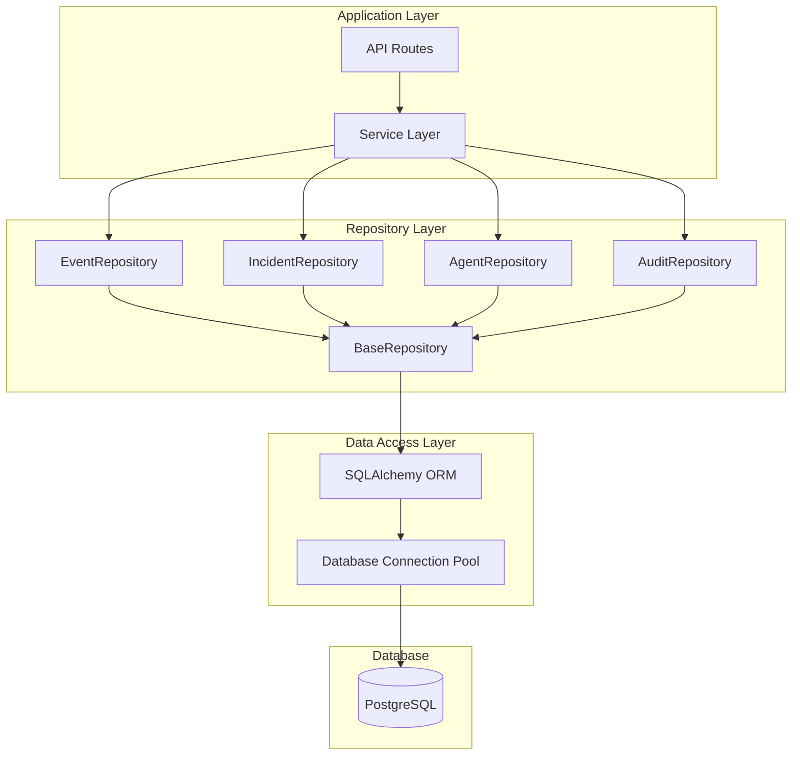

# ADR-003: SQLAlchemy 2.0 with Repository Pattern

**Date**: 2026-03-26  
**Status**: Accepted  
**Authors**: securAIty Team  

## Context

The securAIty platform requires persistent storage for security events, incidents, audit logs, and agent state. The storage layer must provide:

- Type-safe database operations
- Async I/O for high-throughput event storage
- Clean separation between business logic and data access
- Easy testing with mock repositories
- Support for complex queries and aggregations
- Database migration management

### Requirements

1. **Type Safety**: Full static type checking with mypy
2. **Async Support**: Native async/await for all database operations
3. **Testability**: Easy to mock for unit tests
4. **Maintainability**: Clear separation of concerns
5. **Performance**: Efficient queries with proper indexing
6. **Migration Support**: Schema evolution without data loss

## Decision

We will use **SQLAlchemy 2.0** with the **Repository Pattern** for all data persistence operations.

### Architecture



### Repository Hierarchy

```python
# Base repository with common CRUD operations
class BaseRepository(Generic[T]):
    def __init__(self, session: AsyncSession):
        self.session = session
    
    async def get(self, id: UUID) -> Optional[T]: ...
    async def list(self, filters: Optional[dict] = None) -> Sequence[T]: ...
    async def create(self, obj: T) -> T: ...
    async def update(self, id: UUID, updates: dict) -> Optional[T]: ...
    async def delete(self, id: UUID) -> bool: ...

# Specialized repositories
class EventRepository(BaseRepository[SecurityEventModel]):
    async def get_by_correlation_id(self, correlation_id: str) -> Sequence[SecurityEventModel]: ...
    async def get_by_severity(self, severity: Severity) -> Sequence[SecurityEventModel]: ...
    async def get_events_in_timeframe(
        self, 
        start: datetime, 
        end: datetime
    ) -> Sequence[SecurityEventModel]: ...

class IncidentRepository(BaseRepository[IncidentModel]):
    async def get_open_incidents(self) -> Sequence[IncidentModel]: ...
    async def get_by_priority(self, priority: IncidentPriority) -> Sequence[IncidentModel]: ...
    async def get_related_events(self, incident_id: UUID) -> Sequence[SecurityEventModel]: ...
```

### Model Definition (SQLAlchemy 2.0)

```python
from sqlalchemy import String, DateTime, Enum, ForeignKey
from sqlalchemy.orm import DeclarativeBase, Mapped, mapped_column, relationship
from sqlalchemy.dialects.postgresql import UUID, JSONB
from uuid import UUID as uuid_UUID
from datetime import datetime

class Base(DeclarativeBase):
    """Base class for all models."""
    pass

class SecurityEventModel(Base):
    __tablename__ = "security_events"
    
    id: Mapped[uuid_UUID] = mapped_column(
        UUID(as_uuid=True), 
        primary_key=True, 
        default=uuid4
    )
    event_type: Mapped[str] = mapped_column(String(100), nullable=False, index=True)
    severity: Mapped[str] = mapped_column(
        Enum(Severity), 
        nullable=False, 
        index=True
    )
    source: Mapped[str] = mapped_column(String(255), nullable=False, index=True)
    title: Mapped[str] = mapped_column(String(500), nullable=False)
    description: Mapped[str] = mapped_column(String(5000), nullable=False)
    status: Mapped[str] = mapped_column(
        String(50), 
        default="new",
        index=True
    )
    metadata_: Mapped[dict] = mapped_column(
        "metadata", 
        JSONB, 
        default=dict
    )
    occurred_at: Mapped[datetime] = mapped_column(
        DateTime(timezone=True), 
        default=datetime.utcnow,
        index=True
    )
    created_at: Mapped[datetime] = mapped_column(
        DateTime(timezone=True), 
        default=datetime.utcnow
    )
    updated_at: Mapped[Optional[datetime]] = mapped_column(
        DateTime(timezone=True), 
        onupdate=datetime.utcnow
    )
    
    # Relationships
    related_incidents: Mapped[list["IncidentModel"]] = relationship(
        secondary="event_incident_association",
        back_populates="related_events"
    )
    
    __table_args__ = (
        Index("ix_events_occurred_at_type", "occurred_at", "event_type"),
        Index("ix_events_severity_status", "severity", "status"),
    )
```

### Repository Implementation

```python
class EventRepository(BaseRepository[SecurityEventModel]):
    """Repository for security event persistence."""
    
    def __init__(self, session: AsyncSession):
        super().__init__(session)
        self.model = SecurityEventModel
    
    async def get_by_correlation_id(
        self, 
        correlation_id: str
    ) -> Sequence[SecurityEventModel]:
        """Get events by correlation ID for tracing."""
        stmt = select(self.model).where(
            self.model.metadata_["correlation_id"].astext == correlation_id
        )
        result = await self.session.execute(stmt)
        return result.scalars().all()
    
    async def get_by_severity(
        self, 
        severity: Severity
    ) -> Sequence[SecurityEventModel]:
        """Get events by severity level."""
        stmt = select(self.model).where(
            self.model.severity == severity
        ).order_by(self.model.occurred_at.desc())
        result = await self.session.execute(stmt)
        return result.scalars().all()
    
    async def create_with_incident(
        self, 
        event: SecurityEventModel,
        incident: Optional[IncidentModel] = None
    ) -> SecurityEventModel:
        """Create event with optional incident in transaction."""
        async with self.session.begin_nested():
            self.session.add(event)
            if incident:
                self.session.add(incident)
                event.related_incidents.append(incident)
            await self.session.flush()
        return event
    
    async def get_statistics(
        self,
        start_date: datetime,
        end_date: datetime
    ) -> EventStatistics:
        """Get event statistics for time period."""
        stmt = select(
            func.count(self.model.id),
            self.model.severity,
            self.model.status
        ).where(
            self.model.occurred_at.between(start_date, end_date)
        ).group_by(
            self.model.severity,
            self.model.status
        )
        result = await self.session.execute(stmt)
        return EventStatistics.from_rows(result.all())
```

### Database Configuration

```python
from sqlalchemy.ext.asyncio import (
    create_async_engine,
    AsyncSession,
    async_sessionmaker,
    AsyncEngine
)

class DatabaseConfig:
    def __init__(self, database_url: str):
        self.database_url = database_url
        self.engine: Optional[AsyncEngine] = None
        self.session_factory: Optional[async_sessionmaker[AsyncSession]] = None
    
    def initialize(self) -> None:
        """Initialize database engine and session factory."""
        self.engine = create_async_engine(
            self.database_url,
            echo=False,  # Set True for SQL debugging
            pool_size=20,
            max_overflow=40,
            pool_pre_ping=True,  # Verify connections before use
            pool_recycle=3600,  # Recycle connections after 1 hour
            echo_pool=False,
        )
        
        self.session_factory = async_sessionmaker(
            bind=self.engine,
            expire_on_commit=False,
            class_=AsyncSession,
        )
    
    async def get_session(self) -> AsyncGenerator[AsyncSession, None]:
        """Get database session for dependency injection."""
        async with self.session_factory() as session:
            try:
                yield session
                await session.commit()
            except Exception:
                await session.rollback()
                raise
            finally:
                await session.close()
    
    async def close(self) -> None:
        """Close database connections."""
        if self.engine:
            await self.engine.dispose()
```

### Dependency Injection

```python
# FastAPI dependency for repository injection
async def get_event_repository(
    session: AsyncSession = Depends(get_db_session)
) -> EventRepository:
    """Get event repository instance."""
    return EventRepository(session)

async def get_incident_repository(
    session: AsyncSession = Depends(get_db_session)
) -> IncidentRepository:
    """Get incident repository instance."""
    return IncidentRepository(session)

# Usage in API routes
@router.get("/events")
async def list_events(
    repo: EventRepository = Depends(get_event_repository),
    pagination: PaginationParams = Depends(),
) -> PaginatedResponse[EventResponse]:
    events = await repo.list_with_pagination(
        page=pagination.page,
        page_size=pagination.page_size
    )
    return PaginatedResponse(items=events)
```

## Consequences

### Positive

1. **Type Safety**: SQLAlchemy 2.0 provides excellent type hints for mypy
2. **Async Native**: Full async/await support throughout the stack
3. **Separation of Concerns**: Repository pattern cleanly separates data access from business logic
4. **Testability**: Easy to mock repositories for unit tests
5. **Flexibility**: Can change database implementation without affecting business logic
6. **Query Optimization**: Direct SQL access when needed for complex queries
7. **Migration Support**: Alembic integration for schema migrations

### Trade-offs

1. **Boilerplate**: Repository pattern adds some boilerplate code
2. **Learning Curve**: Team needs to understand SQLAlchemy 2.0 syntax
3. **Abstraction Overhead**: Simple queries may feel verbose

### Negative

1. **Additional Layer**: Repository pattern adds indirection
2. **Potential Over-Engineering**: For simple CRUD, direct SQLAlchemy might suffice

## Database Schema

### Core Tables

```sql
-- Security Events
CREATE TABLE security_events (
    id UUID PRIMARY KEY DEFAULT gen_random_uuid(),
    event_type VARCHAR(100) NOT NULL,
    severity VARCHAR(50) NOT NULL,
    source VARCHAR(255) NOT NULL,
    title VARCHAR(500) NOT NULL,
    description VARCHAR(5000) NOT NULL,
    status VARCHAR(50) DEFAULT 'new',
    metadata JSONB DEFAULT '{}',
    occurred_at TIMESTAMPTZ DEFAULT NOW(),
    created_at TIMESTAMPTZ DEFAULT NOW(),
    updated_at TIMESTAMPTZ
);

-- Incidents
CREATE TABLE incidents (
    id UUID PRIMARY KEY DEFAULT gen_random_uuid(),
    title VARCHAR(500) NOT NULL,
    description VARCHAR(10000) NOT NULL,
    category VARCHAR(100) NOT NULL,
    priority VARCHAR(50) NOT NULL,
    status VARCHAR(50) DEFAULT 'new',
    assigned_to VARCHAR(255),
    metadata JSONB DEFAULT '{}',
    created_at TIMESTAMPTZ DEFAULT NOW(),
    updated_at TIMESTAMPTZ,
    resolved_at TIMESTAMPTZ,
    resolution_notes TEXT
);

-- Event-Incident Association
CREATE TABLE event_incident_association (
    event_id UUID REFERENCES security_events(id),
    incident_id UUID REFERENCES incidents(id),
    PRIMARY KEY (event_id, incident_id)
);

-- Agents
CREATE TABLE agents (
    id UUID PRIMARY KEY DEFAULT gen_random_uuid(),
    name VARCHAR(255) NOT NULL,
    agent_type VARCHAR(100) NOT NULL,
    status VARCHAR(50) DEFAULT 'offline',
    capabilities JSONB DEFAULT '[]',
    host VARCHAR(255) NOT NULL,
    port INTEGER,
    registered_at TIMESTAMPTZ DEFAULT NOW(),
    last_heartbeat TIMESTAMPTZ
);

-- Audit Logs
CREATE TABLE audit_logs (
    id UUID PRIMARY KEY DEFAULT gen_random_uuid(),
    action VARCHAR(255) NOT NULL,
    actor VARCHAR(255) NOT NULL,
    resource VARCHAR(255),
    action_type VARCHAR(100),
    details JSONB DEFAULT '{}',
    ip_address INET,
    user_agent TEXT,
    created_at TIMESTAMPTZ DEFAULT NOW()
);

-- Indexes
CREATE INDEX idx_events_occurred_at ON security_events(occurred_at DESC);
CREATE INDEX idx_events_severity ON security_events(severity);
CREATE INDEX idx_events_status ON security_events(status);
CREATE INDEX idx_incidents_status ON incidents(status);
CREATE INDEX idx_incidents_priority ON incidents(priority);
CREATE INDEX idx_audit_logs_created_at ON audit_logs(created_at DESC);
CREATE INDEX idx_audit_logs_actor ON audit_logs(actor);
```

## Migrations

We use Alembic for database migrations:

```bash
# Generate new migration
alembic revision --autogenerate -m "Add security_events table"

# Apply migrations
alembic upgrade head

# Rollback migration
alembic downgrade -1
```

### Migration Example

```python
"""Add security_events table

Revision ID: 001
Revises: 
Create Date: 2026-03-26

"""
from alembic import op
import sqlalchemy as sa
from sqlalchemy.dialects import postgresql

def upgrade() -> None:
    op.create_table(
        'security_events',
        sa.Column('id', postgresql.UUID(as_uuid=True), nullable=False),
        sa.Column('event_type', sa.String(length=100), nullable=False),
        sa.Column('severity', sa.String(length=50), nullable=False),
        sa.Column('source', sa.String(length=255), nullable=False),
        sa.Column('title', sa.String(length=500), nullable=False),
        sa.Column('description', sa.String(length=5000), nullable=False),
        sa.Column('status', sa.String(length=50), nullable=True),
        sa.Column('metadata', postgresql.JSONB(astext_type=sa.Text()), nullable=True),
        sa.Column('occurred_at', sa.DateTime(timezone=True), nullable=True),
        sa.Column('created_at', sa.DateTime(timezone=True), nullable=True),
        sa.Column('updated_at', sa.DateTime(timezone=True), nullable=True),
        sa.PrimaryKeyConstraint('id')
    )
    op.create_index('ix_events_occurred_at', 'security_events', ['occurred_at'])
    op.create_index('ix_events_severity', 'security_events', ['severity'])

def downgrade() -> None:
    op.drop_index('ix_events_severity', table_name='security_events')
    op.drop_index('ix_events_occurred_at', table_name='security_events')
    op.drop_table('security_events')
```

## Testing Strategy

### Repository Tests

```python
class TestEventRepository:
    @pytest.mark.asyncio
    async def test_create_event(self, session: AsyncSession):
        repo = EventRepository(session)
        
        event = SecurityEventModel(
            event_type="security_alert",
            severity="high",
            source="test",
            title="Test Event",
            description="Test Description"
        )
        
        result = await repo.create(event)
        
        assert result.id is not None
        assert result.event_type == "security_alert"
    
    @pytest.mark.asyncio
    async def test_get_by_severity(self, session: AsyncSession, test_events):
        repo = EventRepository(session)
        
        events = await repo.get_by_severity(Severity.HIGH)
        
        assert len(events) > 0
        assert all(e.severity == "high" for e in events)
```

### Service Layer Tests (with Mocks)

```python
class TestEventService:
    @pytest.mark.asyncio
    async def test_create_event(self):
        mock_repo = AsyncMock(spec=EventRepository)
        service = EventService(mock_repo)
        
        await service.create_event(event_data)
        
        mock_repo.create.assert_called_once()
```

## Alternatives Considered

### Django ORM

**Pros:**
- Batteries-included approach
- Excellent admin interface
- Mature migration system

**Cons:**
- Tied to Django framework
- Sync-first (async still maturing)
- Heavier weight than needed

**Verdict**: Too coupled to Django; we need framework independence.

### Tortoise ORM

**Pros:**
- Async-native from the ground up
- Django-like API
- Good type hints

**Cons:**
- Smaller community than SQLAlchemy
- Less mature ecosystem
- Fewer advanced features

**Verdict**: SQLAlchemy has better ecosystem and long-term support.

### Direct SQL with asyncpg

**Pros:**
- Maximum performance
- Full control over queries
- No ORM overhead

**Cons:**
- No type safety
- Manual query building
- Harder to maintain
- No abstraction layer

**Verdict**: Too low-level; ORM provides better maintainability.

## Performance Considerations

### Connection Pooling

```python
engine = create_async_engine(
    database_url,
    pool_size=20,  # Number of connections to keep open
    max_overflow=40,  # Additional connections under load
    pool_pre_ping=True,  # Verify connection before use
    pool_recycle=3600,  # Recycle after 1 hour
)
```

### Query Optimization

```python
# Use selectinload for eager loading to avoid N+1
stmt = select(IncidentModel).options(
    selectinload(IncidentModel.related_events)
)

# Use indexes for common queries
__table_args__ = (
    Index("ix_events_occurred_at_type", "occurred_at", "event_type"),
)

# Use pagination for large result sets
stmt = select(EventModel).offset(offset).limit(limit)
```

## References

- [SQLAlchemy 2.0 Documentation](https://docs.sqlalchemy.org/en/20/)
- [Async SQLAlchemy](https://docs.sqlalchemy.org/en/20/orm/extensions/asyncio.html)
- [Repository Pattern](https://martinfowler.com/eaaCatalog/repository.html)
- [Alembic Migrations](https://alembic.sqlalchemy.org/)

---

**Last Updated**: March 26, 2026
