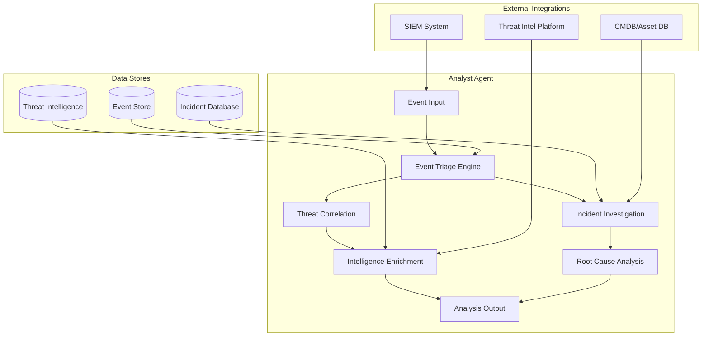
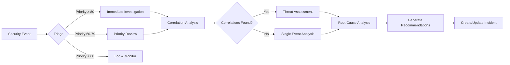
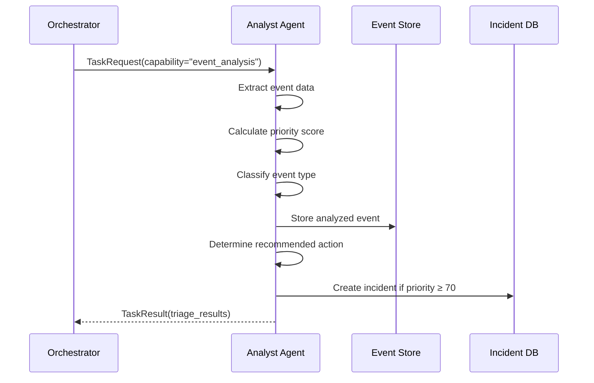
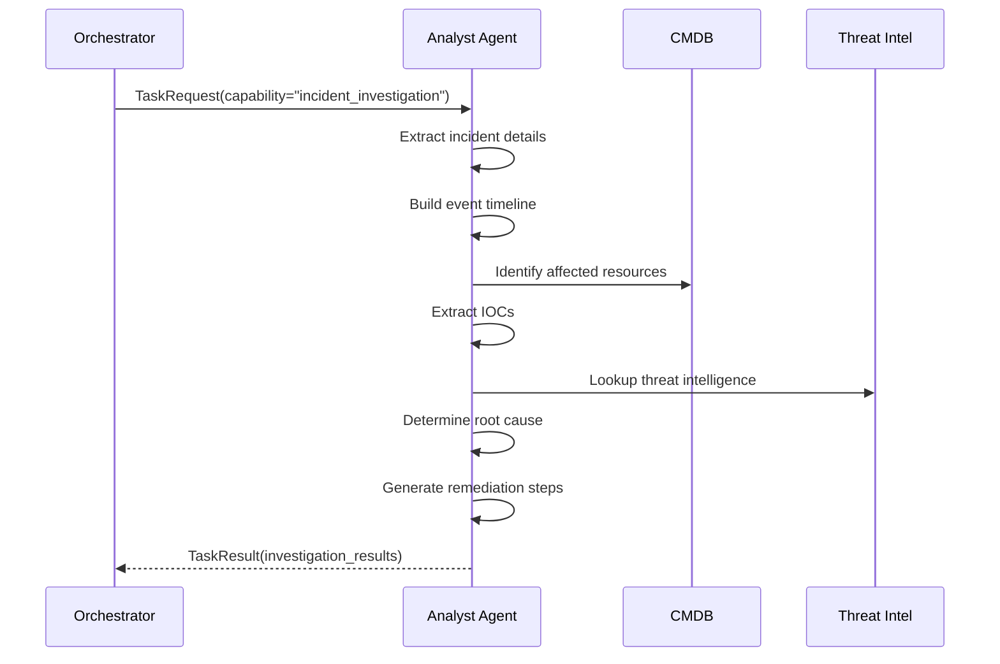
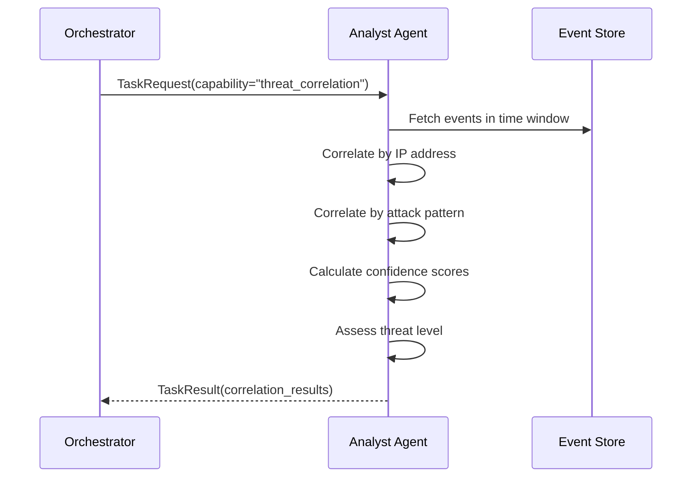

# Threat Analysis Agent

**Agent Type:** `analyst`  
**Version:** 2.0.0  
**Status:** Production Ready

## Purpose and Capabilities

The Threat Analysis Agent (Analyst Agent) is the security operations center (SOC) analyst of the securAIty system. It performs security event analysis, incident investigation, threat correlation, and provides actionable intelligence for security teams.

### Primary Capabilities

| Capability | Description | Priority |
|------------|-------------|----------|
| `event_analysis` | Analyze and triage security events | 10 |
| `incident_investigation` | Investigate security incidents | 20 |
| `threat_correlation` | Correlate threats across events | 30 |
| `root_cause_analysis` | Determine root causes | 40 |
| `intelligence_enrichment` | Enrich with threat intelligence | 50 |

### Use Cases

- **Security Event Triage**: Automatically analyze incoming security events and assign priority
- **Incident Investigation**: Deep-dive analysis of security incidents with timeline reconstruction
- **Threat Correlation**: Connect related events across different sources and time windows
- **Root Cause Analysis**: Identify underlying causes of security incidents
- **Threat Intelligence**: Enrich events with external threat intelligence data

---

## Architecture

### Component Diagram



### Analysis Pipeline



---

## Configuration

### Agent Configuration

```yaml
agent:
  agent_id: "analyst_001"
  name: "Security Analyst Agent"
  description: "Security event analysis and incident investigation"
  max_concurrent_tasks: 10
  task_timeout: 300.0
  capabilities:
    - name: "event_analysis"
      description: "Analyze and triage security events"
      priority: 10
    - name: "incident_investigation"
      description: "Investigate security incidents"
      priority: 20
    - name: "threat_correlation"
      description: "Correlate threats across events"
      priority: 30
    - name: "root_cause_analysis"
      description: "Determine root causes"
      priority: 40
    - name: "intelligence_enrichment"
      description: "Enrich with threat intelligence"
      priority: 50
```

### Environment Variables

```bash
# Analyst Agent Configuration
SECURAITY_ANALYST_MAX_CONCURRENT_TASKS=10
SECURAITY_ANALYST_TASK_TIMEOUT=300
SECURAITY_ANALYST_LOG_LEVEL=INFO

# Threat Intelligence Integration
THREAT_INTEL_ENDPOINT=https://api.threatintel.example.com
THREAT_INTEL_API_KEY=<vault:secret/threat-intel-api-key>

# SIEM Integration
SIEM_ENDPOINT=https://siem.example.com/api
SIEM_API_KEY=<vault:secret/siem-api-key>
```

### NATS Subjects

| Subject | Direction | Description |
|---------|-----------|-------------|
| `securAIty.agent.analyst.task` | Inbound | Task requests from orchestrator |
| `securAIty.agent.analyst.result` | Outbound | Analysis results |
| `securAIty.agent.analyst.health` | Outbound | Health status updates |
| `securAIty.event.security` | Inbound | Security events for analysis |

---

## Event Types Handled

### Security Event Schema

```python
@dataclass
class SecurityEvent:
    event_id: str
    event_type: EventType
    severity: Severity
    timestamp: datetime
    source: str
    resource_id: str
    payload: dict[str, Any]
    correlation_id: Optional[str] = None
```

### Event Type Mapping

| Event Type | Description | Handler Method | Output |
|------------|-------------|----------------|--------|
| `THREAT_DETECTED` | Active threat detection | `_triage_event()` | Priority score, classification |
| `VULNERABILITY_FOUND` | Vulnerability discovery | `_triage_event()` | Risk assessment |
| `POLICY_VIOLATION` | Policy enforcement failure | `_triage_event()` | Compliance impact |
| `ANOMALY_DETECTED` | Behavioral anomaly | `_triage_event()` | Anomaly score |
| `SECURITY_ALERT` | External security alert | `_triage_event()` | Alert validation |

### Severity Levels

| Severity | Priority Score Range | Response Time |
|----------|---------------------|---------------|
| CRITICAL | 90-100 | Immediate (< 5 min) |
| HIGH | 70-89 | Urgent (< 30 min) |
| MEDIUM | 40-69 | Standard (< 4 hours) |
| LOW | 0-39 | Scheduled (< 24 hours) |

---

## Workflows

### Workflow 1: Event Triage



**Example Request:**

```json
{
    "task_id": "task_12345",
    "capability": "event_analysis",
    "input_data": {
        "analysis_type": "triage",
        "event": {
            "event_id": "evt_67890",
            "event_type": "THREAT_DETECTED",
            "severity": "HIGH",
            "source": "ids_sensor_01",
            "resource_id": "server_prod_042",
            "payload": {
                "attack_type": "sql_injection",
                "source_ip": "192.168.1.100",
                "destination_port": 443
            }
        }
    }
}
```

**Example Response:**

```json
{
    "task_id": "task_12345",
    "success": true,
    "output_data": {
        "event_id": "evt_67890",
        "priority": 85,
        "classification": "active_threat",
        "recommended_action": "immediate_investigation",
        "requires_investigation": true,
        "auto_remediation_possible": false
    },
    "execution_time_ms": 125.4,
    "timestamp": "2026-03-26T10:15:30Z"
}
```

### Workflow 2: Incident Investigation



**Example Request:**

```json
{
    "task_id": "task_23456",
    "capability": "incident_investigation",
    "input_data": {
        "analysis_type": "investigate",
        "incident_id": "INC-2026-0326-001",
        "title": "SQL Injection Attack Detected",
        "severity": "HIGH",
        "related_events": [
            {"event_id": "evt_001", "timestamp": 1711447200, "event_type": "THREAT_DETECTED"},
            {"event_id": "evt_002", "timestamp": 1711447260, "event_type": "ANOMALY_DETECTED"}
        ]
    }
}
```

**Example Response:**

```json
{
    "task_id": "task_23456",
    "success": true,
    "output_data": {
        "incident_id": "INC-2026-0326-001",
        "status": "investigated",
        "severity": "HIGH",
        "affected_resources": ["server_prod_042", "db_prod_003"],
        "iocs": ["192.168.1.100", "e3b0c44298fc1c149afbf4c8996fb92427ae41e4649b934ca495991b7852b855"],
        "root_cause": "External threat actor activity detected",
        "remediation_steps": [
            "Contain affected systems",
            "Preserve evidence for forensics",
            "Reset compromised credentials",
            "Apply necessary patches",
            "Block identified IOCs at perimeter"
        ],
        "timeline_events": 2
    },
    "execution_time_ms": 2340.8,
    "timestamp": "2026-03-26T10:16:00Z"
}
```

### Workflow 3: Threat Correlation



**Example Request:**

```json
{
    "task_id": "task_34567",
    "capability": "threat_correlation",
    "input_data": {
        "analysis_type": "correlate",
        "events": [
            {"event_id": "evt_001", "payload": {"ip_address": "192.168.1.100"}},
            {"event_id": "evt_002", "payload": {"ip_address": "192.168.1.100"}},
            {"event_id": "evt_003", "payload": {"ip_address": "10.0.0.50"}}
        ],
        "time_window_hours": 24
    }
}
```

**Example Response:**

```json
{
    "task_id": "task_34567",
    "success": true,
    "output_data": {
        "correlations_found": 2,
        "correlations": [
            {
                "type": "ip_address",
                "related_events": ["evt_001", "evt_002"],
                "confidence": 0.85
            },
            {
                "type": "attack_pattern",
                "related_events": ["evt_001", "evt_003"],
                "confidence": 0.75
            }
        ],
        "related_event_count": 3,
        "threat_assessment": "high"
    },
    "execution_time_ms": 456.2,
    "timestamp": "2026-03-26T10:17:00Z"
}
```

---

## Tools and Integrations

### SIEM Integration

The Analyst Agent integrates with SIEM systems for event ingestion:

```python
# SIEM event ingestion
async def ingest_siem_events(siem_endpoint: str, api_key: str) -> list[SecurityEvent]:
    """Fetch security events from SIEM."""
    async with aiohttp.ClientSession() as session:
        async with session.get(
            f"{siem_endpoint}/api/v1/events",
            headers={"Authorization": f"Bearer {api_key}"},
            params={"severity": "HIGH,CRITICAL", "last_hours": 24}
        ) as response:
            events = await response.json()
            return [SecurityEvent(**e) for e in events]
```

### Threat Intelligence Platforms

Integration with threat intelligence for IOC enrichment:

| Platform | Integration Type | Data Retrieved |
|----------|-----------------|----------------|
| MISP | REST API | IOCs, threat actors, TTPs |
| Anomali | TAXII/STIX | Threat feeds, indicators |
| Recorded Future | API | Risk scores, threat context |
| Internal TIP | Direct DB | Historical analysis, patterns |

### Asset Management (CMDB)

Integration with CMDB for asset context:

```python
# Asset lookup
async def get_asset_context(resource_id: str, cmdb_endpoint: str) -> dict[str, Any]:
    """Retrieve asset information from CMDB."""
    async with aiohttp.ClientSession() as session:
        async with session.get(
            f"{cmdb_endpoint}/api/assets/{resource_id}"
        ) as response:
            asset = await response.json()
            return {
                "asset_name": asset.get("name"),
                "asset_type": asset.get("type"),
                "criticality": asset.get("criticality", "medium"),
                "owner": asset.get("owner"),
                "location": asset.get("location"),
            }
```

---

## Incident Data Model

### Incident Structure

```python
@dataclass
class Incident:
    incident_id: str              # Unique identifier
    title: str                     # Incident title
    severity: str                  # CRITICAL, HIGH, MEDIUM, LOW
    status: str = "open"           # open, investigating, contained, resolved, closed
    affected_resources: list[str]  # List of affected resource IDs
    indicators: list[str]          # IOCs and evidence
    timeline: list[dict]           # Chronological event list
    root_cause: str                # Root cause analysis
    remediation_steps: list[str]   # Remediation actions
```

### Timeline Entry Structure

```json
{
    "timestamp": 1711447200,
    "event_type": "THREAT_DETECTED",
    "description": "SQL injection attempt detected on web server",
    "severity": "HIGH",
    "source": "ids_sensor_01",
    "action_taken": "Blocked source IP"
}
```

---

## Analysis Methods

### Priority Calculation

The priority score determines incident urgency:

```python
def calculate_priority(event_data: dict) -> int:
    """Calculate event priority score (0-100)."""
    score = 50  # Base score

    # Severity adjustment
    severity_scores = {"CRITICAL": 40, "HIGH": 25, "MEDIUM": 0, "LOW": -20}
    score += severity_scores.get(event_data.get("severity", "MEDIUM"), 0)

    # Event type adjustment
    if "THREAT" in event_data.get("event_type", ""):
        score += 15
    if "VULNERABILITY" in event_data.get("event_type", ""):
        score += 10

    # Asset criticality adjustment
    if event_data.get("asset_criticality") == "critical":
        score += 20
    elif event_data.get("asset_criticality") == "high":
        score += 10

    return min(score, 100)
```

### Classification Logic

| Event Type Pattern | Classification |
|-------------------|----------------|
| `THREAT_DETECTED` | active_threat |
| `VULNERABILITY_FOUND` | vulnerability |
| `POLICY_VIOLATION` | compliance |
| `ANOMALY_DETECTED` | anomaly |
| `SECURITY_ALERT` | alert |

### Root Cause Categories

| Root Cause | Description |
|------------|-------------|
| External threat actor activity | Attack from external source |
| Unpatched vulnerability exploited | Known vulnerability not patched |
| Security policy not enforced | Policy gap or misconfiguration |
| Insider threat | Malicious or negligent insider |
| System misconfiguration | Incorrect security settings |

---

## Troubleshooting

### Issue: Analysis Takes Too Long

**Symptoms:**
- Task execution time exceeds timeout
- Orchestrator reports task timeout

**Diagnosis:**
```bash
# Check agent resource usage
docker stats securAIty-agent-analyst-1

# Review task queue depth
nats sub "securAIty.agent.analyst.task" --count
```

**Resolution:**
1. Increase `task_timeout` in agent configuration
2. Reduce event batch size
3. Scale horizontally (add more analyst agents)
4. Optimize threat intelligence lookups (add caching)

### Issue: False Positive Triage

**Symptoms:**
- High number of low-priority events marked as high priority
- SOC team overwhelmed with false positives

**Resolution:**
```python
# Adjust priority calculation thresholds
# In configuration:
analyst:
  priority_thresholds:
    critical: 90    # Increase from default 80
    high: 75        # Increase from default 70
    medium: 50      # Adjust as needed
```

### Issue: Correlation Missing Related Events

**Symptoms:**
- Related events not being correlated
- Incidents appear as isolated events

**Diagnosis:**
```python
# Check correlation time window
# Default is 24 hours, may need adjustment
input_data = {
    "time_window_hours": 48  # Increase window
}
```

**Resolution:**
1. Increase time window for correlation analysis
2. Verify event timestamps are synchronized (NTP)
3. Check correlation rules for completeness

### Issue: Threat Intelligence Lookup Failures

**Symptoms:**
- Enrichment returns empty results
- Timeout errors on intelligence lookups

**Resolution:**
```bash
# Verify TIP connectivity
curl -H "Authorization: Bearer $TIP_API_KEY" \
     https://tip.example.com/api/v1/health

# Check API rate limits
# Review agent logs for rate limit errors
docker logs securAIty-agent-analyst-1 | grep "rate limit"
```

### Debug Mode

Enable detailed logging for troubleshooting:

```yaml
agent:
  log_level: "DEBUG"
  enable_logging: true
```

```bash
# View debug logs
docker logs --tail 1000 securAIty-agent-analyst-1 | grep DEBUG
```

---

## Security Considerations

### Data Handling

- **Sensitive Data**: All event data encrypted at rest
- **PII Protection**: Personal information masked in logs
- **Retention**: Events retained for 90 days, incidents for 7 years
- **Access Control**: Role-based access to incident data

### Integration Security

- **API Authentication**: All external integrations use API keys from Vault
- **TLS**: All communications encrypted with TLS 1.3+
- **Rate Limiting**: Outbound requests rate-limited to prevent abuse
- **Input Validation**: All external data validated before processing

---

## Metrics and Monitoring

### Key Metrics

| Metric | Type | Description | Alert Threshold |
|--------|------|-------------|-----------------|
| `analyst.events.processed` | Counter | Total events analyzed | - |
| `analyst.incidents.created` | Counter | Incidents created | - |
| `analyst.triage.duration_ms` | Histogram | Triage execution time | p99 > 500ms |
| `analyst.correlation.hits` | Counter | Successful correlations | - |
| `analyst.errors.total` | Counter | Analysis errors | > 10/hour |

### Health Indicators

| Indicator | Healthy | Degraded | Unhealthy |
|-----------|---------|----------|-----------|
| Event Processing | < 1000 queued | 1000-5000 queued | > 5000 queued |
| Task Success Rate | > 99% | 95-99% | < 95% |
| Average Triage Time | < 200ms | 200-500ms | > 500ms |

---

## Related Documentation

- [Multi-Agent Overview](overview.md) - System architecture
- [Antivirus Agent](antivirus.md) - Malware detection integration
- [Engineer Agent](engineer.md) - Automated remediation
- [API Documentation](../api/openapi.yaml) - REST API reference

---

## Changelog

### Version 2.0.0
- Added threat correlation engine
- Improved priority calculation algorithm
- Enhanced root cause analysis
- Integrated with external threat intelligence platforms

### Version 1.0.0
- Initial release
- Event triage and classification
- Incident investigation workflows
