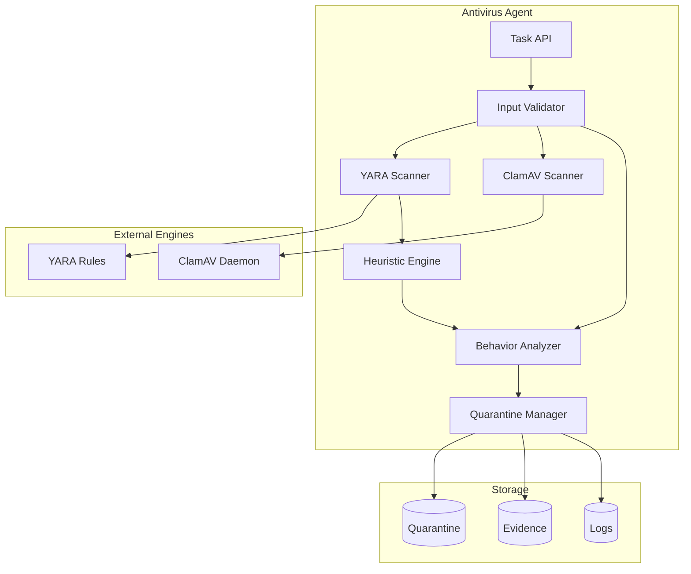
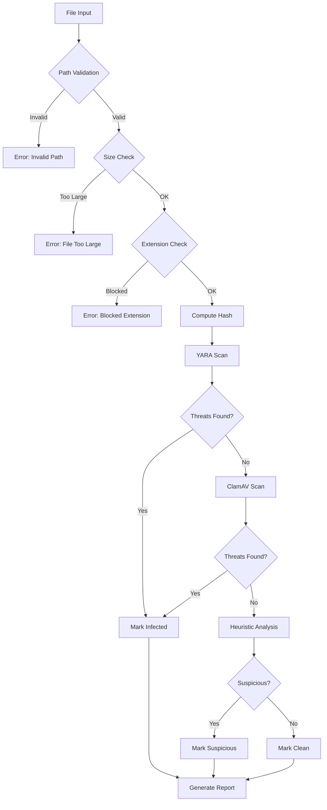
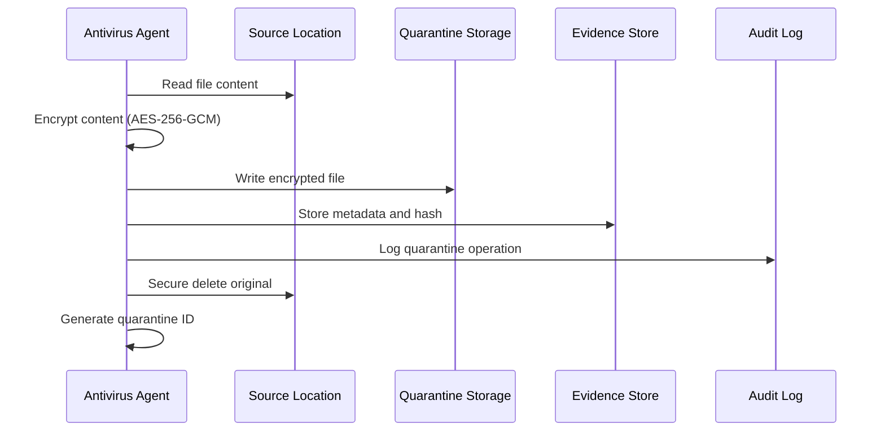
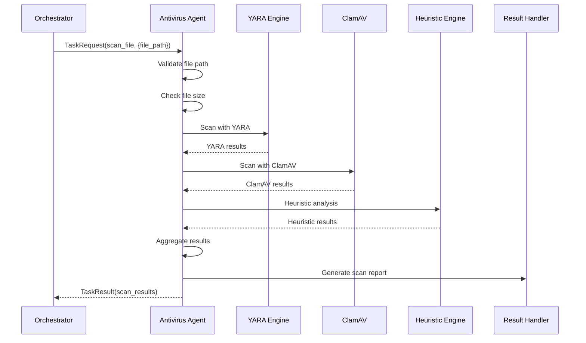
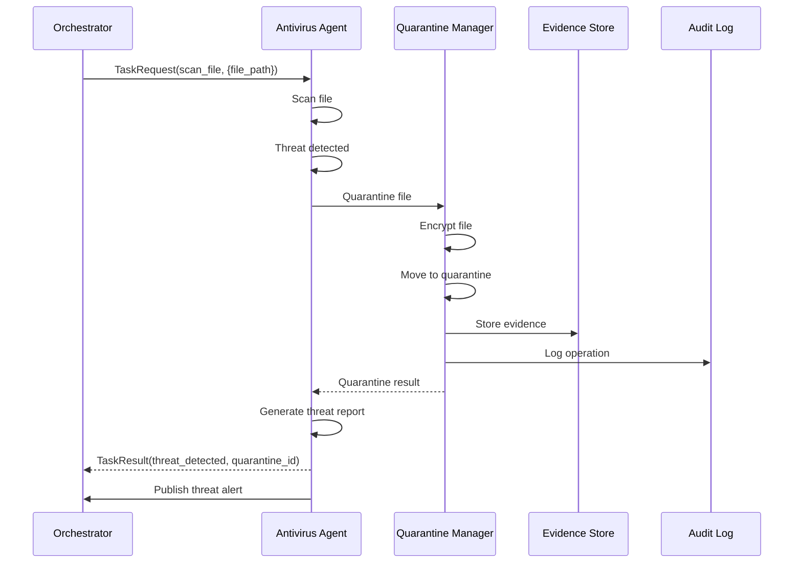

# Antivirus Agent

**Agent Type:** `antivirus`  
**Version:** 2.0.0  
**Status:** Production Ready

## Purpose and Capabilities

The Antivirus Agent provides AI-powered malware detection and threat response capabilities for the securAIty platform. It combines multiple scanning engines with behavioral analysis to detect and respond to malicious files and processes.

### Primary Capabilities

| Capability | Description | Priority |
|------------|-------------|----------|
| `scan_file` | Scan single file for malware | 10 |
| `scan_directory` | Recursively scan directory | 20 |
| `quarantine_file` | Move infected file to secure quarantine | 30 |
| `analyze_behavior` | Analyze process behavior for anomalies | 40 |

### Detection Methods

- **YARA Rules**: Pattern-based malware detection using YARA rules
- **ClamAV Integration**: Signature-based detection via ClamAV daemon
- **Heuristic Analysis**: Behavioral and structural analysis for unknown threats
- **Behavioral Monitoring**: Real-time process behavior analysis

### Use Cases

- **File Scanning**: On-demand scanning of files and directories
- **Real-time Monitoring**: File system watcher for new file detection
- **Incident Response**: Quarantine infected files during security incidents
- **Malware Analysis**: Behavioral analysis of suspicious processes
- **Compliance Scanning**: Regular scans for compliance requirements

---

## Architecture

### Component Diagram



### Scanning Pipeline



### Quarantine Flow



---

## Configuration

### Agent Configuration

```yaml
antivirus:
  agent_id: "antivirus_001"
  name: "Antivirus Agent"
  description: "Real-time malware detection and response"
  max_concurrent_tasks: 10
  task_timeout: 300.0
  
  # Scanning configuration
  yara_rules_path: "/etc/yara/rules"
  clamav_socket_path: "/var/run/clamav/clamav.ctl"
  quarantine_directory: "/var/quarantine/securAIty"
  max_file_size_bytes: 104857600  # 100MB
  
  # File type configuration
  allowed_extensions:
    - ".exe"
    - ".dll"
    - ".so"
    - ".bin"
    - ".pdf"
    - ".doc"
    - ".docx"
    - ".zip"
    - ".rar"
  
  # Security configuration
  quarantine_encryption_key_env: "ANTIVIRUS_QUARANTINE_KEY"
```

### Environment Variables

```bash
# Antivirus Agent Configuration
SECURAITY_ANTIVIRUS_MAX_CONCURRENT_TASKS=10
SECURAITY_ANTIVIRUS_TASK_TIMEOUT=300
SECURAITY_ANTIVIRUS_LOG_LEVEL=INFO

# YARA Configuration
YARA_RULES_PATH=/etc/yara/rules

# ClamAV Configuration
CLAMAV_SOCKET_PATH=/var/run/clamav/clamav.ctl
CLAMAV_MAX_SCAN_SIZE=104857600

# Quarantine Configuration
QUARANTINE_DIRECTORY=/var/quarantine/securAIty
ANTIVIRUS_QUARANTINE_KEY=<vault:secret/quarantine-key>

# File Type Configuration
ALLOWED_FILE_EXTENSIONS=".exe,.dll,.so,.bin,.pdf,.doc,.docx,.zip,.rar"
MAX_FILE_SIZE_MB=100
```

### NATS Subjects

| Subject | Direction | Description |
|---------|-----------|-------------|
| `securAIty.agent.antivirus.task` | Inbound | Task requests from orchestrator |
| `securAIty.agent.antivirus.result` | Outbound | Scan results |
| `securAIty.agent.antivirus.health` | Outbound | Health status updates |
| `securAIty.agent.antivirus.threat` | Outbound | Threat detection alerts |

---

## Event Types Handled

### Scan Request Events

| Event Type | Description | Input Schema |
|------------|-------------|--------------|
| `FILE_SCAN_REQUEST` | Request to scan a file | `{file_path: string, priority: string}` |
| `DIRECTORY_SCAN_REQUEST` | Request to scan directory | `{dir_path: string, recursive: boolean}` |
| `QUARANTINE_REQUEST` | Request to quarantine file | `{file_path: string, reason: string}` |
| `BEHAVIOR_ANALYSIS_REQUEST` | Request process analysis | `{process_name: string, pid: int}` |

### Scan Result Events

| Event Type | Description | Output Schema |
|------------|-------------|---------------|
| `FILE_SCAN_RESULT` | File scan completion | `{file_path, status, threats, hash}` |
| `DIRECTORY_SCAN_RESULT` | Directory scan completion | `{dir_path, results: array, summary}` |
| `QUARANTINE_RESULT` | Quarantine operation result | `{original_path, quarantine_id, status}` |
| `BEHAVIOR_ANALYSIS_RESULT` | Behavior analysis result | `{process_name, risk_score, anomalies}` |

### Threat Severity Levels

| Severity | Description | Action |
|----------|-------------|--------|
| `CRITICAL` | Active malware, ransomware | Immediate quarantine |
| `HIGH` | Known malware, trojans | Quarantine recommended |
| `MEDIUM` | Suspicious files, PUPs | Review and decide |
| `LOW` | Potentially unwanted | Log and monitor |
| `INFORMATIONAL` | Clean files | No action required |

---

## YARA Rule Integration

### Rule Structure

YARA rules are stored in `/etc/yara/rules/` with the following structure:

```
/etc/yara/rules/
├── malware/
│   ├── ransomware.yar
│   ├── trojans.yar
│   └── worms.yar
├── suspicious/
│   ├── packers.yar
│   └── crypters.yar
├── compliance/
│   ├── pci_dss.yar
│   └── hipaa.yar
└── custom/
    └── organization_rules.yar
```

### Example YARA Rule

```yara
rule SecurAIty_Ransomware_Generic : ransomware
{
    meta:
        description = "Generic ransomware detection rule"
        author = "securAIty Security Team"
        severity = "critical"
        created = "2026-01-15"
        
    strings:
        $s1 = "Your files have been encrypted" ascii
        $s2 = "Pay Bitcoin to decrypt" ascii
        $s3 = ".encrypted" ascii
        $hex1 = { 4D 5A 90 00 03 00 00 00 }  // PE header
        
    condition:
        2 of them or $hex1 at 0
}
```

### Rule Registration

```python
# Register custom YARA rule at runtime
rule_content = """
rule Custom_Detection {
    strings:
        $malicious = "malicious_pattern"
    condition:
        $malicious
}
"""

await antivirus_agent.register_yara_rule(rule_content)
```

### Rule Compilation and Loading

```python
async def load_yara_rules(rules_path: str) -> list:
    """Load and compile YARA rules from directory."""
    compiled_rules = []
    
    for rule_file in Path(rules_path).glob("*.yar"):
        with open(rule_file, "r") as f:
            rule_content = f.read()
        
        try:
            # Compile rule
            compiled = yara.compile(source=rule_content)
            compiled_rules.append({
                "file": str(rule_file),
                "compiled": compiled,
                "loaded_at": datetime.now(timezone.utc),
            })
        except yara.SyntaxError as e:
            logger.error(f"Failed to compile {rule_file}: {e}")
    
    return compiled_rules
```

---

## Example Workflows

### Workflow 1: Single File Scan



**Example Request:**

```json
{
    "task_id": "task_av_001",
    "capability": "scan_file",
    "input_data": {
        "file_path": "/uploads/user_document.pdf"
    }
}
```

**Example Response:**

```json
{
    "task_id": "task_av_001",
    "success": true,
    "output_data": {
        "file_path": "/uploads/user_document.pdf",
        "status": "clean",
        "threats_detected": [],
        "severity": "informational",
        "file_hash": "e3b0c44298fc1c149afbf4c8996fb92427ae41e4649b934ca495991b7852b855",
        "file_size": 245678,
        "scan_duration_ms": 342.5,
        "scanner_engine": "yara+clamav+heuristic",
        "timestamp": "2026-03-26T10:30:00Z"
    },
    "execution_time_ms": 342.5,
    "timestamp": "2026-03-26T10:30:00Z"
}
```

### Workflow 2: Infected File Detection and Quarantine



**Example Request:**

```json
{
    "task_id": "task_av_002",
    "capability": "scan_file",
    "input_data": {
        "file_path": "/downloads/suspicious_executable.exe"
    }
}
```

**Example Response (Infected):**

```json
{
    "task_id": "task_av_002",
    "success": true,
    "output_data": {
        "file_path": "/downloads/suspicious_executable.exe",
        "status": "infected",
        "threats_detected": [
            "SecurAIty_Ransomware_Generic",
            "ClamAV.Win.Ransomware.Generic"
        ],
        "severity": "critical",
        "file_hash": "a1b2c3d4e5f6789012345678901234567890abcdef",
        "file_size": 1024000,
        "scan_duration_ms": 567.8,
        "scanner_engine": "yara+clamav+heuristic",
        "timestamp": "2026-03-26T10:35:00Z",
        "quarantine_result": {
            "original_path": "/downloads/suspicious_executable.exe",
            "quarantine_path": "/var/quarantine/securAIty/files/q_20260326_001.enc",
            "status": "success",
            "quarantine_id": "q_20260326_001",
            "timestamp": "2026-03-26T10:35:01Z"
        }
    },
    "execution_time_ms": 1234.5,
    "timestamp": "2026-03-26T10:35:01Z"
}
```

### Workflow 3: Directory Scan

**Example Request:**

```json
{
    "task_id": "task_av_003",
    "capability": "scan_directory",
    "input_data": {
        "dir_path": "/home/user/documents",
        "recursive": true
    }
}
```

**Example Response:**

```json
{
    "task_id": "task_av_003",
    "success": true,
    "output_data": {
        "directory": "/home/user/documents",
        "scan_summary": {
            "total_files": 156,
            "clean_files": 154,
            "infected_files": 1,
            "suspicious_files": 1,
            "errors": 0,
            "total_size_bytes": 52428800,
            "scan_duration_ms": 45678.9
        },
        "findings": [
            {
                "file_path": "/home/user/documents/suspicious.exe",
                "status": "infected",
                "threats": ["SecurAIty_Trojan_Generic"],
                "severity": "high"
            },
            {
                "file_path": "/home/user/documents/packed_file.zip",
                "status": "suspicious",
                "threats": ["Packer_Detected"],
                "severity": "medium"
            }
        ]
    },
    "execution_time_ms": 45678.9,
    "timestamp": "2026-03-26T10:40:00Z"
}
```

### Workflow 4: Behavioral Analysis

**Example Request:**

```json
{
    "task_id": "task_av_004",
    "capability": "analyze_behavior",
    "input_data": {
        "process_name": "suspicious_process.exe"
    }
}
```

**Example Response:**

```json
{
    "task_id": "task_av_004",
    "success": true,
    "output_data": {
        "process_name": "suspicious_process.exe",
        "risk_score": 75,
        "anomalies_detected": [
            "high_risk_behavior_detected",
            "moderate_risk_behavior_detected"
        ],
        "suspicious_activities": [
            "Attempting to modify system files",
            "Connecting to known malicious IP",
            "Creating persistence mechanism"
        ],
        "network_connections": [
            {"destination": "192.168.1.100:4444", "protocol": "TCP", "status": "established"},
            {"destination": "10.0.0.50:8080", "protocol": "TCP", "status": "syn_sent"}
        ],
        "file_operations": [
            {"operation": "write", "path": "/etc/passwd", "result": "denied"},
            {"operation": "create", "path": "/tmp/backdoor.sh", "result": "success"}
        ],
        "recommendation": "immediate_investigation",
        "timestamp": "2026-03-26T10:45:00Z"
    },
    "execution_time_ms": 2345.6,
    "timestamp": "2026-03-26T10:45:00Z"
}
```

---

## Security Controls

### Path Traversal Prevention

```python
def validate_file_path(file_path: str) -> Optional[Path]:
    """Validate file path to prevent path traversal attacks."""
    try:
        # Resolve to absolute path
        resolved = Path(file_path).resolve()
        
        # Check for allowed base directories
        allowed_bases = [
            Path("/uploads"),
            Path("/home"),
            Path("/tmp"),
        ]
        
        if not any(str(resolved).startswith(str(base)) for base in allowed_bases):
            return None
        
        # Prevent symlink attacks
        if resolved.is_symlink():
            real_path = resolved.resolve()
            if not any(str(real_path).startswith(str(base)) for base in allowed_bases):
                return None
        
        return resolved
        
    except Exception:
        return None
```

### File Extension Validation

```python
ALLOWED_EXTENSIONS = {
    ".exe", ".dll", ".so", ".bin", ".scr", ".bat", ".cmd", ".ps1",
    ".pdf", ".doc", ".docx", ".xls", ".xlsx", ".ppt", ".pptx",
    ".zip", ".rar", ".7z", ".tar", ".gz",
    ".jpg", ".jpeg", ".png", ".gif", ".bmp", ".tiff",
    ".txt", ".rtf", ".csv", ".json", ".xml", ".yaml", ".yml",
}

DANGEROUS_EXTENSIONS = {
    ".aspx", ".asp", ".jsp", ".php", ".pl", ".cgi",
    ".htaccess", ".htpasswd", ".sh", ".bash",
}

def validate_extension(file_path: Path) -> bool:
    """Validate file extension."""
    ext = file_path.suffix.lower()
    
    # Block dangerous extensions
    if ext in DANGEROUS_EXTENSIONS:
        return False
    
    # Allow if in allowed list or unknown extension
    return ext in ALLOWED_EXTENSIONS or ext == ""
```

### Quarantine Encryption

```python
from cryptography.hazmat.primitives.ciphers.aead import AESGCM
import os

async def encrypt_for_quarantine(data: bytes) -> bytes:
    """Encrypt data for secure quarantine storage."""
    # Get encryption key from secure source
    key = os.environ.get("ANTIVIRUS_QUARANTINE_KEY")
    key_bytes = base64.b64decode(key)
    
    # Generate random nonce
    nonce = os.urandom(12)  # 96-bit nonce for GCM
    
    # Encrypt with AES-256-GCM
    aesgcm = AESGCM(key_bytes)
    ciphertext = aesgcm.encrypt(nonce, data, None)
    
    # Prepend nonce to ciphertext
    return nonce + ciphertext
```

---

## Troubleshooting

### Issue: Scan Fails with "File Not Accessible"

**Symptoms:**
- Scan returns error status
- Error message: "File not accessible"

**Diagnosis:**
```bash
# Check file permissions
ls -la /path/to/file

# Check agent user
docker exec securAIty-agent-antivirus-1 id

# Verify file exists
test -f /path/to/file && echo "exists" || echo "not found"
```

**Resolution:**
1. Ensure file exists and is readable by agent user
2. Check SELinux/AppArmor policies
3. Verify file is not locked by another process
4. Check disk space and inode availability

### Issue: ClamAV Connection Failed

**Symptoms:**
- Scan results show only YARA results
- Logs show ClamAV connection errors

**Diagnosis:**
```bash
# Check ClamAV daemon status
docker-compose ps clamav

# Test socket connection
docker exec securAIty-agent-antivirus-1 \
    nc -U /var/run/clamav/clamav.ctl

# Check ClamAV logs
docker logs securAIty-clamav-1
```

**Resolution:**
```bash
# Restart ClamAV daemon
docker-compose restart clamav

# Verify socket path matches configuration
grep clamav_socket_path config/agents/antivirus.yaml
```

### Issue: YARA Rules Not Loading

**Symptoms:**
- Health check shows degraded status
- Scan results don't include YARA detections

**Diagnosis:**
```bash
# Check YARA rules directory
ls -la /etc/yara/rules/

# Validate YARA rule syntax
yara-check /etc/yara/rules/*.yar

# Check agent logs for compilation errors
docker logs securAIty-agent-antivirus-1 | grep -i yara
```

**Resolution:**
```bash
# Fix syntax errors in rules
# Recompile rules
for rule in /etc/yara/rules/*.yar; do
    yara-check "$rule" || echo "Error in $rule"
done

# Reload rules (restart agent)
docker-compose restart antivirus
```

### Issue: Quarantine Directory Full

**Symptoms:**
- Quarantine operations fail
- Disk space alerts

**Diagnosis:**
```bash
# Check quarantine directory size
du -sh /var/quarantine/securAIty/

# List quarantined files
ls -la /var/quarantine/securAIty/files/

# Check retention policy
grep retention config/agents/antivirus.yaml
```

**Resolution:**
```bash
# Clean up old quarantined files (older than retention period)
find /var/quarantine/securAIty/files/ -type f -mtime +90 -delete

# Expand quarantine volume
# Or adjust retention policy in configuration
```

### Issue: High Memory Usage During Directory Scan

**Symptoms:**
- Agent memory usage spikes
- OOM killer terminates agent

**Resolution:**
```yaml
# Reduce concurrent scans
antivirus:
  max_concurrent_scans: 5  # Reduce from default 10

# Add memory limits in Docker
services:
  antivirus:
    deploy:
      resources:
        limits:
          memory: 2G
        reservations:
          memory: 512M
```

---

## Performance Tuning

### Scan Performance

| Parameter | Default | Recommended (High Volume) | Description |
|-----------|---------|--------------------------|-------------|
| `max_concurrent_scans` | 10 | 20 | Parallel file scans |
| `max_file_size_bytes` | 100MB | 50MB | Maximum file size |
| `scan_timeout` | 300s | 120s | Per-file timeout |

### YARA Optimization

```bash
# Compile rules for faster loading
yarac /etc/yara/rules/*.yar /etc/yara/rules.compiled

# Use compiled rules in configuration
antivirus:
  yara_rules_path: "/etc/yara/rules.compiled"
```

### ClamAV Tuning

```conf
# /etc/clamav/clamd.conf
MaxScanSize 100M
MaxFileSize 50M
MaxRecursion 16
MaxFiles 10000
ScanPE yes
ScanELF yes
ScanOLE2 yes
ScanMail yes
ScanArchive yes
```

---

## Metrics and Monitoring

### Key Metrics

| Metric | Type | Description | Alert Threshold |
|--------|------|-------------|-----------------|
| `antivirus.scans.total` | Counter | Total scans performed | - |
| `antivirus.scans.infected` | Counter | Infected files detected | - |
| `antivirus.quarantine.total` | Counter | Files quarantined | - |
| `antivirus.scan.duration_ms` | Histogram | Scan duration | p99 > 5s |
| `antivirus.errors.total` | Counter | Scan errors | > 10/hour |

### Health Indicators

| Indicator | Healthy | Degraded | Unhealthy |
|-----------|---------|----------|-----------|
| YARA Rules | Loaded | Partial load | Failed |
| ClamAV | Connected | Intermittent | Disconnected |
| Quarantine | Writable | Read-only | Failed |
| Scan Queue | < 100 | 100-500 | > 500 |

---

## Security Considerations

### Quarantine Security

- **Encryption**: All quarantined files encrypted with AES-256-GCM
- **Isolation**: Quarantine directory has restricted permissions (root only)
- **Audit Trail**: All quarantine operations logged with timestamps
- **Retention**: Files retained for 90 days, then securely deleted

### Scanning Security

- **Path Validation**: All paths validated to prevent traversal attacks
- **Symlink Protection**: Symlinks resolved and validated before scanning
- **Size Limits**: File size limits prevent resource exhaustion
- **Extension Filtering**: Dangerous file extensions blocked

### Key Management

- **Encryption Keys**: Stored in HashiCorp Vault
- **Key Rotation**: Automatic rotation every 90 days
- **Access Control**: Keys accessible only to antivirus agent

---

## Related Documentation

- [Multi-Agent Overview](overview.md) - System architecture
- [Analyst Agent](analyst.md) - Threat analysis integration
- [Engineer Agent](engineer.md) - Automated remediation
- [Security Runbooks](../runbooks/) - Operational procedures

---

## Changelog

### Version 2.0.0
- Added behavioral analysis capability
- Enhanced quarantine encryption
- Improved YARA rule management
- Added ClamAV integration

### Version 1.0.0
- Initial release
- Basic file scanning with YARA
- Quarantine functionality
