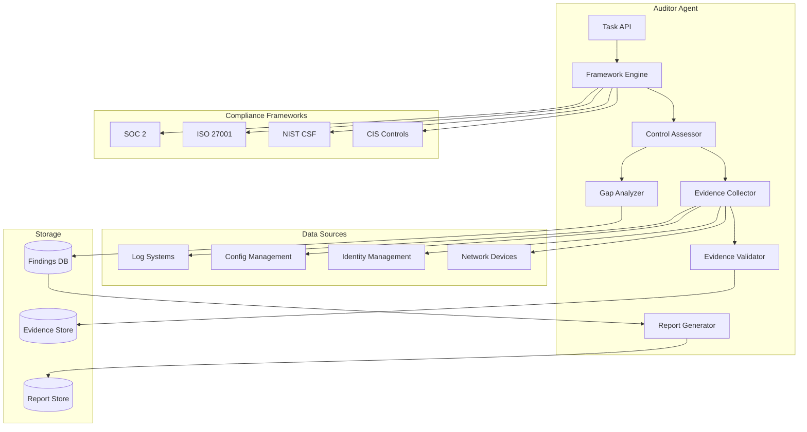
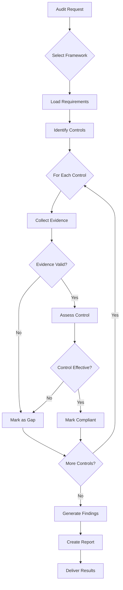
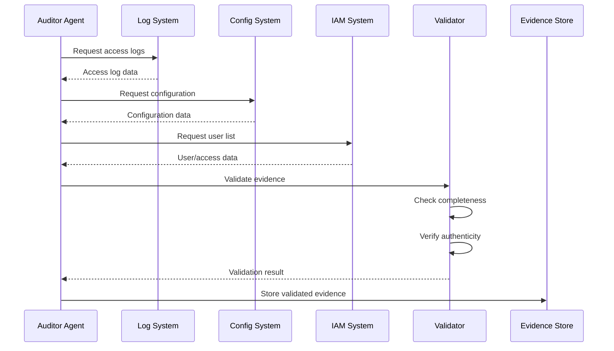
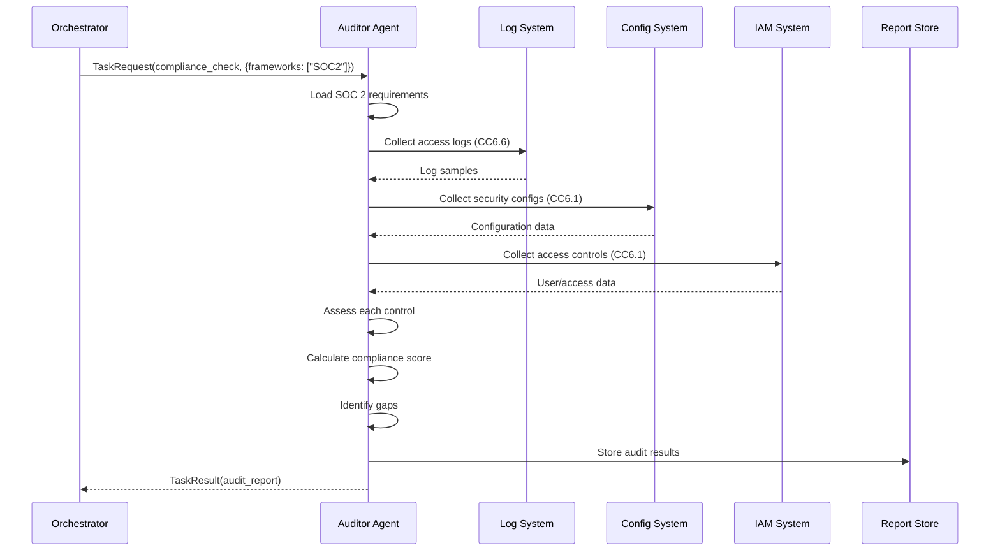

# Compliance Auditor Agent

**Author:** CertifiedSlop

**Agent Type:** `auditor`  
**Version:** 2.0.0  
**Status:** Production Ready

## Purpose and Capabilities

The Compliance Auditor Agent (Auditor Agent) provides automated compliance auditing, security assessment, and audit report generation for the securAIty platform. It evaluates security controls against industry frameworks and regulatory requirements, collecting evidence and identifying compliance gaps.

### Primary Capabilities

| Capability | Description | Priority |
|------------|-------------|----------|
| `compliance_auditing` | Audit against compliance frameworks | 10 |
| `control_assessment` | Assess security control effectiveness | 20 |
| `evidence_collection` | Collect and validate audit evidence | 30 |
| `gap_analysis` | Identify compliance gaps | 40 |
| `report_generation` | Generate audit reports | 50 |

### Supported Compliance Frameworks

| Framework | Description | Controls Covered |
|-----------|-------------|------------------|
| SOC 2 | Service Organization Controls | CC6.1, CC6.6, CC6.7, CC7.1, CC7.2 |
| ISO 27001 | Information Security Management | A.9.1, A.12.4, A.13.1, A.14.1 |
| NIST CSF | Cybersecurity Framework | AC-1, AU-1, SC-1, IR-1 |
| CIS Controls | Critical Security Controls | 1.1, 2.1, 3.1, 8.1 |
| PCI DSS | Payment Card Industry | Requirements 1-12 |
| HIPAA | Healthcare Privacy | Administrative, Physical, Technical |
| GDPR | Data Protection Regulation | Articles 25, 32, 33, 34 |

### Use Cases

- **Continuous Compliance Monitoring**: Ongoing assessment of compliance posture
- **Audit Preparation**: Pre-audit assessment and gap identification
- **Control Testing**: Regular testing of security control effectiveness
- **Evidence Collection**: Automated collection of audit evidence
- **Compliance Reporting**: Generate reports for auditors and management
- **Gap Analysis**: Identify and prioritize compliance gaps

---

## Architecture

### Component Diagram



### Audit Workflow



### Evidence Collection Flow



---

## Configuration

### Agent Configuration

```yaml
auditor:
  agent_id: "auditor_001"
  name: "Security Auditor Agent"
  description: "Compliance auditing and security assessment"
  max_concurrent_tasks: 5
  task_timeout: 600.0
  
  # Framework configuration
  frameworks:
    enabled:
      - "SOC2"
      - "ISO27001"
      - "NIST"
      - "CIS"
    default_scope: "full"
    
  # Evidence collection
  evidence:
    retention_days: 365
    encryption_enabled: true
    sources:
      - "logs"
      - "configurations"
      - "access_controls"
      - "network_devices"
      
  # Assessment configuration
  assessment:
    auto_remediate: false
    require_manual_review: true
    threshold_scores:
      compliant: 90
      partial: 70
      non_compliant: 0
      
  # Reporting configuration
  reporting:
    formats:
      - "executive"
      - "detailed"
      - "technical"
    include_evidence: true
    include_recommendations: true
```

### Environment Variables

```bash
# Auditor Agent Configuration
SECURAITY_AUDITOR_MAX_CONCURRENT_TASKS=5
SECURAITY_AUDITOR_TASK_TIMEOUT=600
SECURAITY_AUDITOR_LOG_LEVEL=INFO

# Framework Configuration
AUDITOR_FRAMEWORKS=SOC2,ISO27001,NIST,CIS
AUDITOR_DEFAULT_SCOPE=full

# Evidence Collection
AUDITOR_EVIDENCE_RETENTION_DAYS=365
AUDITOR_EVIDENCE_ENCRYPTION_ENABLED=true

# Integration Endpoints
AUDITOR_LOG_ENDPOINT=https://siem.example.com/api/logs
AUDITOR_CONFIG_ENDPOINT=https://config.example.com/api/config
AUDITOR_IAM_ENDPOINT=https://iam.example.com/api/users

# Reporting
AUDITOR_REPORT_FORMATS=executive,detailed,technical
AUDITOR_REPORT_OUTPUT_PATH=/var/reports/audit
```

### NATS Subjects

| Subject | Direction | Description |
|---------|-----------|-------------|
| `securAIty.agent.auditor.task` | Inbound | Task requests from orchestrator |
| `securAIty.agent.auditor.result` | Outbound | Audit results |
| `securAIty.agent.auditor.health` | Outbound | Health status updates |
| `securAIty.agent.auditor.finding` | Outbound | Compliance findings |

---

## Event Types Handled

### Audit Request Events

| Event Type | Description | Input Schema |
|------------|-------------|--------------|
| `COMPLIANCE_AUDIT_REQUEST` | Request compliance audit | `{frameworks, scope}` |
| `CONTROL_ASSESSMENT_REQUEST` | Request control assessment | `{control_ids, criteria}` |
| `EVIDENCE_COLLECTION_REQUEST` | Request evidence collection | `{requirement_ids, sources}` |
| `REPORT_GENERATION_REQUEST` | Request audit report | `{report_type, audit_id}` |

### Audit Result Events

| Event Type | Description | Output Schema |
|------------|-------------|---------------|
| `COMPLIANCE_AUDIT_RESULT` | Audit completion | `{framework, score, findings}` |
| `CONTROL_ASSESSMENT_RESULT` | Assessment results | `{control_id, status, evidence}` |
| `EVIDENCE_COLLECTION_RESULT` | Collection results | `{requirement_id, evidence_items}` |
| `AUDIT_REPORT` | Generated report | `{report_id, type, findings, summary}` |

### Compliance Status Definitions

| Status | Description | Criteria |
|--------|-------------|----------|
| `COMPLIANT` | Fully meets requirement | All evidence present, control effective |
| `PARTIAL` | Partially meets requirement | Some evidence present, control partially effective |
| `NON_COMPLIANT` | Does not meet requirement | Evidence missing, control ineffective |
| `NOT_APPLICABLE` | Requirement not applicable | Documented justification |
| `NOT_ASSESSED` | Not yet assessed | Pending assessment |

---

## Policy Evaluation

### Control Categories

| Category | Description | Example Controls |
|----------|-------------|------------------|
| Access Control | Identity and access management | User provisioning, MFA, least privilege |
| Monitoring | Logging and detection | Log collection, SIEM, alerting |
| Data Protection | Data security | Encryption, DLP, backup |
| Incident Management | Response procedures | IR plan, incident handling |
| Configuration | System hardening | Baselines, patch management |
| Asset Management | Inventory and classification | Asset register, ownership |
| Development | Secure SDLC | Code review, security testing |
| Network Security | Network protection | Firewalls, segmentation |

### Evidence Requirements by Category

```python
EVIDENCE_REQUIREMENTS = {
    "access_control": [
        "access_logs",
        "user_list",
        "permission_matrix",
        "mfa_configuration",
        "access_review_records",
    ],
    "monitoring": [
        "log_samples",
        "alert_configuration",
        "siem_dashboard",
        "incident_tickets",
        "escalation_procedures",
    ],
    "data_protection": [
        "encryption_configuration",
        "data_flow_diagram",
        "dlp_logs",
        "backup_records",
        "key_management_logs",
    ],
    "incident_management": [
        "incident_response_plan",
        "incident_logs",
        "postmortem_reports",
        "communication_templates",
        "testing_exercise_records",
    ],
    "configuration": [
        "configuration_baselines",
        "hardening_guides",
        "scan_results",
        "patch_records",
        "change_logs",
    ],
    "asset_management": [
        "asset_inventory",
        "ownership_records",
        "classification_records",
        "disposal_certificates",
    ],
    "development": [
        "sdlc_documentation",
        "code_review_logs",
        "security_test_results",
        "dependency_scan_results",
    ],
    "network_security": [
        "network_diagrams",
        "firewall_rules",
        "segmentation_verification",
        "ids_ips_logs",
    ],
}
```

### Assessment Scoring

```python
def calculate_control_score(evidence_count: int, required_count: int, effectiveness: float) -> float:
    """
    Calculate control assessment score.
    
    Args:
        evidence_count: Number of evidence items collected
        required_count: Number of evidence items required
        effectiveness: Control effectiveness (0-100)
    
    Returns:
        Score from 0-100
    """
    evidence_completeness = (evidence_count / required_count) * 100 if required_count > 0 else 0
    
    # Weight: 60% evidence completeness, 40% effectiveness
    score = (evidence_completeness * 0.6) + (effectiveness * 0.4)
    
    return min(score, 100)
```

### Compliance Status Determination

```python
def determine_compliance_status(score: float) -> ComplianceStatus:
    """Determine compliance status based on score."""
    if score >= 90:
        return ComplianceStatus.COMPLIANT
    elif score >= 70:
        return ComplianceStatus.PARTIAL
    elif score > 0:
        return ComplianceStatus.NON_COMPLIANT
    else:
        return ComplianceStatus.NOT_ASSESSED
```

---

## Example Workflows

### Workflow 1: SOC 2 Compliance Audit



**Example Request:**

```json
{
    "task_id": "task_audit_001",
    "capability": "compliance_check",
    "input_data": {
        "frameworks": ["SOC2"],
        "scope": "full",
        "period": {
            "start": "2026-01-01",
            "end": "2026-03-26"
        }
    }
}
```

**Example Response:**

```json
{
    "task_id": "task_audit_001",
    "success": true,
    "output_data": {
        "audit_type": "compliance",
        "frameworks": ["SOC2"],
        "scope": "full",
        "assessments": [
            {
                "framework": "SOC2",
                "total_controls": 5,
                "compliant": 3,
                "non_compliant": 1,
                "partial": 1,
                "compliance_percentage": 80.0,
                "assessments": [
                    {
                        "requirement_id": "SOC2_CC6.1",
                        "control_id": "CC6.1",
                        "description": "Logical Access Controls",
                        "status": "COMPLIANT",
                        "effectiveness_score": 95,
                        "evidence_count": 5,
                        "evidence_required": 5
                    },
                    {
                        "requirement_id": "SOC2_CC6.6",
                        "control_id": "CC6.6",
                        "description": "Security Event Logging",
                        "status": "PARTIAL",
                        "effectiveness_score": 65,
                        "evidence_count": 3,
                        "evidence_required": 5
                    }
                ]
            }
        ],
        "summary": {
            "overall_compliance": 80.0,
            "critical_gaps": 1,
            "total_findings": 2,
            "recommendations": 5
        },
        "report_id": "rpt_soc2_20260326"
    },
    "execution_time_ms": 123456.7,
    "timestamp": "2026-03-26T12:00:00Z"
}
```

### Workflow 2: Control Assessment

**Example Request:**

```json
{
    "task_id": "task_audit_002",
    "capability": "policy_audit",
    "input_data": {
        "control_ids": ["SOC2_CC6.1", "ISO27001_A.9.1"],
        "criteria": "effectiveness"
    }
}
```

**Example Response:**

```json
{
    "task_id": "task_audit_002",
    "success": true,
    "output_data": {
        "assessment_type": "control",
        "controls_assessed": [
            {
                "control_id": "SOC2_CC6.1",
                "criteria": "effectiveness",
                "effectiveness_score": 95,
                "status": "effective",
                "findings": [],
                "recommendations": ["Continue monitoring", "Document procedures"]
            },
            {
                "control_id": "ISO27001_A.9.1",
                "criteria": "effectiveness",
                "effectiveness_score": 70,
                "status": "partially_effective",
                "findings": [
                    {
                        "finding_id": "find_001",
                        "severity": "MEDIUM",
                        "description": "Access reviews not performed quarterly",
                        "evidence": "Last review was 6 months ago"
                    }
                ],
                "recommendations": [
                    "Implement quarterly access review process",
                    "Automate access review reminders"
                ]
            }
        ],
        "overall_effectiveness": 82.5
    },
    "execution_time_ms": 45678.9,
    "timestamp": "2026-03-26T12:05:00Z"
}
```

### Workflow 3: Gap Analysis

**Example Request:**

```json
{
    "task_id": "task_audit_003",
    "capability": "gap_analysis",
    "input_data": {
        "frameworks": ["SOC2", "ISO27001"],
        "current_state": {
            "SOC2_CC6.1": {"implemented": true, "score": 95},
            "SOC2_CC6.6": {"implemented": false, "score": 0},
            "ISO27001_A.9.1": {"implemented": true, "score": 70}
        }
    }
}
```

**Example Response:**

```json
{
    "task_id": "task_audit_003",
    "success": true,
    "output_data": {
        "analysis_type": "gap",
        "frameworks": ["SOC2", "ISO27001"],
        "gaps_identified": 2,
        "gaps": [
            {
                "requirement_id": "SOC2_CC6.6",
                "framework": "SOC2",
                "control_id": "CC6.6",
                "description": "Missing: Security Event Logging",
                "severity": "HIGH",
                "remediation": "Implement comprehensive security event logging",
                "effort": "medium",
                "estimated_days": 14
            },
            {
                "requirement_id": "ISO27001_A.9.1",
                "framework": "ISO27001",
                "control_id": "A.9.1",
                "description": "Partial: Access Control Policy",
                "severity": "MEDIUM",
                "remediation": "Complete access control policy implementation",
                "effort": "low",
                "estimated_days": 7
            }
        ],
        "priority_remediation": [
            "SOC2_CC6.6",
            "ISO27001_A.9.1"
        ],
        "estimated_effort": {
            "total_days": 21,
            "critical_path": ["SOC2_CC6.6"],
            "resources_required": 2
        }
    },
    "execution_time_ms": 34567.8,
    "timestamp": "2026-03-26T12:10:00Z"
}
```

### Workflow 4: Report Generation

**Example Request:**

```json
{
    "task_id": "task_audit_004",
    "capability": "report_generation",
    "input_data": {
        "report_type": "executive",
        "audit_id": "rpt_soc2_20260326",
        "scope": "Q1 2026 SOC 2 Audit"
    }
}
```

**Example Response:**

```json
{
    "task_id": "task_audit_004",
    "success": true,
    "output_data": {
        "report_id": "rpt_soc2_20260326",
        "type": "executive_summary",
        "audit_type": "compliance",
        "scope": "Q1 2026 SOC 2 Audit",
        "summary": {
            "total_findings": 5,
            "critical": 0,
            "high": 1,
            "medium": 3,
            "low": 1,
            "overall_compliance": 80.0
        },
        "key_findings": [
            {
                "finding_id": "find_001",
                "severity": "HIGH",
                "description": "Security event logging incomplete",
                "impact": "May not detect security incidents"
            },
            {
                "finding_id": "find_002",
                "severity": "MEDIUM",
                "description": "Access reviews not performed quarterly",
                "impact": "Stale access may persist"
            }
        ],
        "recommendations": [
            "Implement comprehensive logging across all systems",
            "Establish quarterly access review process",
            "Document security procedures"
        ],
        "generated_at": 1711454400
    },
    "execution_time_ms": 5678.9,
    "timestamp": "2026-03-26T12:15:00Z"
}
```

---

## Reporting

### Report Types

| Type | Audience | Content | Format |
|------|----------|---------|--------|
| Executive | Leadership | High-level summary, key risks | PDF, Dashboard |
| Detailed | Security Team | All findings, evidence references | PDF, HTML |
| Technical | Engineers | Technical details, remediation steps | Markdown, JSON |
| Auditor | External Auditors | Evidence index, control mapping | PDF, Excel |

### Report Structure

```markdown
# Compliance Audit Report

## Executive Summary
- Overall compliance score
- Key findings summary
- Risk assessment

## Audit Scope
- Frameworks assessed
- Systems in scope
- Audit period

## Findings by Framework
### SOC 2
- CC6.1: Logical Access Controls (Compliant)
- CC6.6: Security Event Logging (Partial)
  - Finding: Incomplete log coverage
  - Evidence: LOG-001, LOG-002
  - Recommendation: Expand log collection

## Gap Analysis
- Identified gaps
- Priority ranking
- Remediation roadmap

## Evidence Index
- Evidence ID mapping
- Collection dates
- Verification status

## Appendices
- Control test procedures
- Detailed evidence
- Glossary
```

### Finding Severity Classification

| Severity | Description | Remediation Timeline |
|----------|-------------|---------------------|
| CRITICAL | Immediate risk to compliance | 24-48 hours |
| HIGH | Significant compliance gap | 7 days |
| MEDIUM | Moderate compliance gap | 30 days |
| LOW | Minor compliance gap | 90 days |
| OBSERVATION | Improvement opportunity | Next audit cycle |

---

## Troubleshooting

### Issue: Evidence Collection Fails

**Symptoms:**
- Audit shows missing evidence
- Evidence collection returns errors

**Diagnosis:**
```bash
# Check integration connectivity
curl -H "Authorization: Bearer $API_KEY" \
     https://siem.example.com/api/health

# Verify evidence source configuration
cat /etc/auditor/sources.yaml

# Check agent logs
docker logs securAIty-agent-auditor-1 | grep -i evidence
```

**Resolution:**
1. Verify integration endpoints are accessible
2. Check API credentials in Vault
3. Ensure evidence sources are configured correctly
4. Validate network connectivity to data sources

### Issue: Compliance Score Inaccurate

**Symptoms:**
- Score doesn't match manual assessment
- Controls marked incorrectly

**Resolution:**
```yaml
# Adjust scoring thresholds
auditor:
  assessment:
    threshold_scores:
      compliant: 85      # Adjust from 90
      partial: 65        # Adjust from 70
      non_compliant: 0
```

### Issue: Framework Requirements Missing

**Symptoms:**
- Some controls not assessed
- Requirements not found

**Resolution:**
```yaml
# Verify framework configuration
auditor:
  frameworks:
    enabled:
      - "SOC2"
      - "ISO27001"
      - "NIST"
      - "CIS"
    
    # Reload framework definitions
    reload_on_startup: true
```

### Issue: Report Generation Fails

**Symptoms:**
- Report generation timeout
- Incomplete reports

**Resolution:**
```yaml
# Increase timeout for large audits
auditor:
  task_timeout: 900.0  # Increase from 600
  
  reporting:
    batch_size: 50     # Reduce batch size
    parallel_generation: false  # Disable parallel generation
```

### Debug Mode

Enable detailed logging for troubleshooting:

```yaml
auditor:
  log_level: "DEBUG"
  logging:
    include_evidence_details: true
    include_assessment_logic: true
```

---

## Security Considerations

### Evidence Security

- **Encryption**: All evidence encrypted at rest with AES-256-GCM
- **Access Control**: Role-based access to audit evidence
- **Integrity**: Evidence hashed for tamper detection
- **Retention**: Configurable retention with secure deletion

### Audit Integrity

- **Immutable Records**: Audit findings stored in append-only storage
- **Timestamp Verification**: All timestamps verified against NTP
- **Chain of Custody**: Evidence collection logged with full audit trail
- **Independent Verification**: Critical findings require manual review

### Data Privacy

- **PII Handling**: Personal information masked in reports
- **Data Minimization**: Only required evidence collected
- **Consent Tracking**: Evidence collection consent documented
- **Right to Erasure**: Evidence deletion on request (with audit trail)

---

## Metrics and Monitoring

### Key Metrics

| Metric | Type | Description | Alert Threshold |
|--------|------|-------------|-----------------|
| `auditor.audits.total` | Counter | Total audits performed | - |
| `auditor.audits.passed` | Counter | Passed audits | - |
| `auditor.findings.total` | Counter | Total findings | - |
| `auditor.findings.critical` | Counter | Critical findings | > 0 |
| `auditor.evidence.collected` | Counter | Evidence items collected | - |
| `auditor.audit.duration_ms` | Histogram | Audit duration | p99 > 10min |

### Health Indicators

| Indicator | Healthy | Degraded | Unhealthy |
|-----------|---------|----------|-----------|
| Evidence Sources | All connected | Some disconnected | All disconnected |
| Assessment Queue | < 5 | 5-20 | > 20 |
| Success Rate | > 95% | 80-95% | < 80% |
| Report Generation | < 30s | 30-120s | > 120s |

---

## Related Documentation

- [Multi-Agent Overview](overview.md) - System architecture
- [Engineer Agent](engineer.md) - Remediation integration
- [Security Runbooks](../runbooks/) - Operational procedures
- [Compliance Frameworks](../policies/) - Policy definitions

---

## Changelog

### Version 2.0.0
- Added ISO 27001 and NIST framework support
- Enhanced evidence collection automation
- Improved gap analysis algorithms
- Added executive report generation

### Version 1.0.0
- Initial release
- SOC 2 compliance auditing
- Basic control assessment

---

&copy; 2026 CertifiedSlop. All rights reserved.
