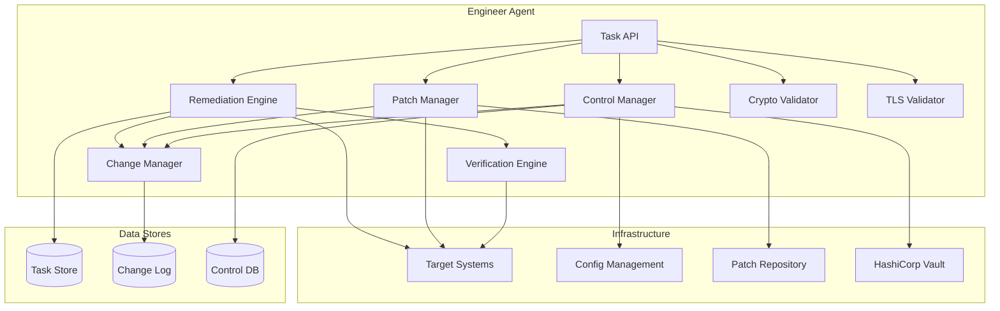
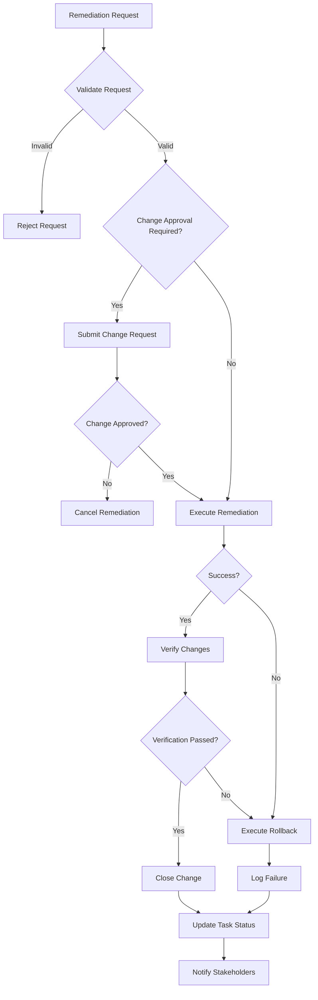
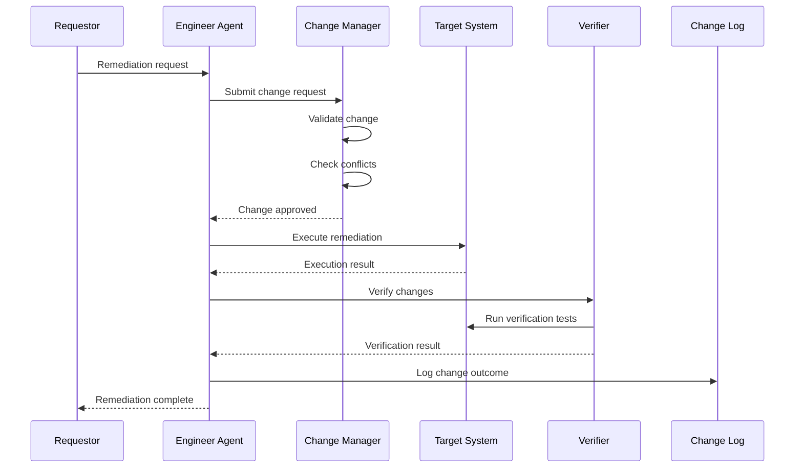
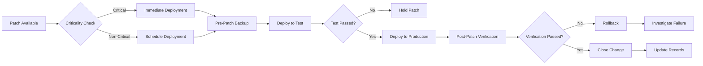
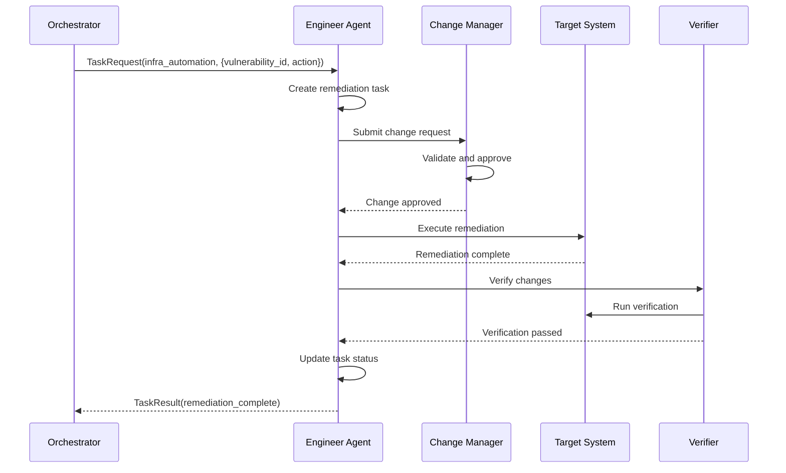

# Security Engineer Agent

**Author:** CertifiedSlop

**Agent Type:** `engineer`  
**Version:** 2.0.0  
**Status:** Production Ready

## Purpose and Capabilities

The Security Engineer Agent (Engineer Agent) provides automated security remediation, patch management, security control configuration, and infrastructure automation for the securAIty platform. It implements security fixes, manages changes, and validates remediation success.

### Primary Capabilities

| Capability | Description | Priority |
|------------|-------------|----------|
| `automated_remediation` | Execute automated security fixes | 10 |
| `patch_management` | Manage security patches | 20 |
| `control_configuration` | Configure security controls | 30 |
| `change_management` | Manage security changes | 40 |
| `verification` | Verify remediation success | 50 |

### Specialized Engineering Functions

The Security Engineer Agent includes specialized capabilities for:

- **Cryptography Management**: Validate cryptographic configurations
- **Authentication System Review**: Assess authentication security
- **Security Hardening**: Generate and implement hardening recommendations
- **TLS/Certificate Validation**: Validate TLS configurations and certificates

### Use Cases

- **Incident Response**: Automated containment and remediation during incidents
- **Vulnerability Remediation**: Patch and fix identified vulnerabilities
- **Security Control Deployment**: Configure and update security controls
- **Infrastructure Hardening**: Apply security hardening to systems
- **Change Management**: Track and audit security changes
- **Compliance Remediation**: Fix compliance gaps identified by Auditor Agent

---

## Architecture

### Component Diagram



### Remediation Workflow



### Change Management Flow



---

## Configuration

### Agent Configuration

```yaml
engineer:
  agent_id: "engineer_001"
  name: "Security Engineer Agent"
  description: "Automated security remediation and control implementation"
  max_concurrent_tasks: 5
  task_timeout: 600.0
  
  # Remediation configuration
  remediation:
    auto_approve_low_risk: true
    require_approval_threshold: "MEDIUM"
    rollback_on_failure: true
    max_retries: 3
    
  # Patch management
  patching:
    auto_patch_critical: true
    patch_window: "saturday 02:00-06:00"
    test_before_deploy: true
    backup_before_patch: true
    
  # Security controls
  controls:
    default_controls:
      - "firewall"
      - "access_control"
      - "encryption"
      - "logging"
    enforce_compliance: true
    
  # Change management
  change_management:
    enabled: true
    require_approval_for:
      - "production"
      - "critical_systems"
    notification_channels:
      - "slack"
      - "email"
```

### Environment Variables

```bash
# Engineer Agent Configuration
SECURAITY_ENGINEER_MAX_CONCURRENT_TASKS=5
SECURAITY_ENGINEER_TASK_TIMEOUT=600
SECURAITY_ENGINEER_LOG_LEVEL=INFO

# Remediation Configuration
ENGINEER_AUTO_APPROVE_LOW_RISK=true
ENGINEER_REQUIRE_APPROVAL_THRESHOLD=MEDIUM
ENGINEER_ROLLBACK_ON_FAILURE=true

# Patch Management
ENGINEER_AUTO_PATCH_CRITICAL=true
ENGINEER_PATCH_WINDOW="saturday 02:00-06:00"
ENGINEER_TEST_BEFORE_DEPLOY=true

# Change Management
ENGINEER_CHANGE_MANAGEMENT_ENABLED=true
ENGINEER_REQUIRE_APPROVAL_FOR=production,critical_systems

# Integration Endpoints
ENGINEER_CONFIG_MGMT_ENDPOINT=https://ansible.example.com/api
ENGINEER_PATCH_REPO_ENDPOINT=https://patches.example.com/api
ENGINEER_VAULT_ENDPOINT=https://vault.example.com
```

### NATS Subjects

| Subject | Direction | Description |
|---------|-----------|-------------|
| `securAIty.agent.engineer.task` | Inbound | Task requests from orchestrator |
| `securAIty.agent.engineer.result` | Outbound | Remediation results |
| `securAIty.agent.engineer.health` | Outbound | Health status updates |
| `securAIty.agent.engineer.change` | Outbound | Change notifications |

---

## Event Types Handled

### Remediation Request Events

| Event Type | Description | Input Schema |
|------------|-------------|--------------|
| `REMEDIATION_REQUEST` | Request security remediation | `{vulnerability_id, target, action}` |
| `PATCH_REQUEST` | Request patch deployment | `{patch_id, target_system}` |
| `CONFIG_DEPLOY_REQUEST` | Request configuration deploy | `{control_id, configuration}` |
| `VERIFICATION_REQUEST` | Request verification | `{task_id, target}` |

### Remediation Result Events

| Event Type | Description | Output Schema |
|------------|-------------|---------------|
| `REMEDIATION_RESULT` | Remediation completion | `{task_id, status, changes, verification}` |
| `PATCH_RESULT` | Patch deployment result | `{patch_id, status, stages}` |
| `CONFIG_RESULT` | Configuration result | `{control_id, status, changes}` |
| `VERIFICATION_RESULT` | Verification result | `{task_id, verified, details}` |

### Remediation Actions

| Action | Description | Risk Level | Auto-Approve |
|--------|-------------|------------|--------------|
| `patch` | Apply security patch | Low | Yes (critical) |
| `config_change` | Update configuration | Medium | No |
| `access_revoke` | Revoke compromised access | Medium | Yes (incident) |
| `firewall_rule` | Add firewall rule | Low | Yes |
| `credential_rotate` | Rotate credentials | Medium | No |
| `service_restart` | Restart service | Low | Yes |

---

## Automated Response Actions

### Remediation Action Catalog

```python
REMEDIATION_ACTIONS = {
    "patch": {
        "description": "Apply security patch",
        "steps": [
            "Pre-patch system check",
            "Create system backup",
            "Download and verify patch",
            "Apply patch",
            "Post-patch verification",
            "Update patch records"
        ],
        "rollback": "Restore from backup",
        "verification": "Check patch version"
    },
    "config_change": {
        "description": "Update security configuration",
        "steps": [
            "Backup current configuration",
            "Apply new configuration",
            "Validate configuration syntax",
            "Restart affected services",
            "Verify functionality"
        ],
        "rollback": "Restore previous configuration",
        "verification": "Configuration audit"
    },
    "access_revoke": {
        "description": "Revoke compromised access",
        "steps": [
            "Identify compromised credentials",
            "Disable affected accounts",
            "Revoke active sessions",
            "Update access control lists",
            "Notify affected users"
        ],
        "rollback": "Restore access after investigation",
        "verification": "Access attempt test"
    },
    "firewall_rule": {
        "description": "Add or modify firewall rule",
        "steps": [
            "Define rule parameters",
            "Validate rule syntax",
            "Apply rule to firewall",
            "Verify rule active",
            "Test connectivity"
        ],
        "rollback": "Remove firewall rule",
        "verification": "Port scan verification"
    },
    "credential_rotate": {
        "description": "Rotate credentials",
        "steps": [
            "Generate new credentials",
            "Update credential store",
            "Update dependent systems",
            "Verify new credentials work",
            "Invalidate old credentials"
        ],
        "rollback": "Restore previous credentials",
        "verification": "Authentication test"
    }
}
```

### Patch Management Pipeline



### Verification Methods

```python
VERIFICATION_METHODS = {
    "patch": {
        "method": "version_check",
        "command": "rpm -q --queryformat '%{VERSION}' package_name",
        "expected": "patch_version",
        "timeout": 30
    },
    "config_change": {
        "method": "config_audit",
        "command": "grep -E 'setting' /etc/config.conf",
        "expected": "expected_value",
        "timeout": 30
    },
    "firewall_rule": {
        "method": "port_scan",
        "command": "nmap -p port target",
        "expected": "open|closed",
        "timeout": 60
    },
    "access_revoke": {
        "method": "access_test",
        "command": "attempt_login revoked_user",
        "expected": "access_denied",
        "timeout": 30
    }
}
```

---

## Example Workflows

### Workflow 1: Automated Vulnerability Remediation



**Example Request:**

```json
{
    "task_id": "task_eng_001",
    "capability": "infra_automation",
    "input_data": {
        "vulnerability_id": "CVE-2026-1234",
        "target": "server_prod_042",
        "action": "patch",
        "patch_id": "PATCH-2026-0326-001"
    }
}
```

**Example Response:**

```json
{
    "task_id": "task_eng_001",
    "success": true,
    "output_data": {
        "task_id": "rem_12345",
        "status": "completed",
        "changes_applied": [
            {
                "type": "patch_applied",
                "target": "server_prod_042",
                "patch_id": "PATCH-2026-0326-001"
            }
        ],
        "verification": {
            "success": true,
            "verified_changes": 1,
            "total_changes": 1,
            "details": [
                {
                    "change_type": "patch_applied",
                    "verified": true,
                    "details": {
                        "patch_status": "installed",
                        "version": "1.2.3"
                    }
                }
            ]
        },
        "change_id": "chg_20260326_001"
    },
    "execution_time_ms": 234567.8,
    "timestamp": "2026-03-26T13:00:00Z"
}
```

### Workflow 2: Patch Management

**Example Request:**

```json
{
    "task_id": "task_eng_002",
    "capability": "patch_management",
    "input_data": {
        "patch_id": "SECURITY-PATCH-2026-03",
        "target_system": "web_cluster",
        "patch_type": "security"
    }
}
```

**Example Response:**

```json
{
    "task_id": "task_eng_002",
    "success": true,
    "output_data": {
        "patch_id": "SECURITY-PATCH-2026-03",
        "target_system": "web_cluster",
        "status": "completed",
        "stages": [
            {
                "name": "pre_check",
                "success": true,
                "details": {
                    "disk_space": "sufficient",
                    "dependencies": "satisfied",
                    "compatibility": "verified"
                }
            },
            {
                "name": "backup",
                "success": true,
                "details": {
                    "backup_id": "backup_web_cluster_20260326",
                    "location": "/backups/web_cluster"
                }
            },
            {
                "name": "apply",
                "success": true,
                "details": {
                    "patch_id": "SECURITY-PATCH-2026-03",
                    "applied_at": "2026-03-26T13:05:00Z"
                }
            },
            {
                "name": "verify",
                "success": true,
                "details": {
                    "patch_verified": true,
                    "system_healthy": true,
                    "services_running": true
                }
            }
        ]
    },
    "execution_time_ms": 456789.0,
    "timestamp": "2026-03-26T13:10:00Z"
}
```

### Workflow 3: Security Control Configuration

**Example Request:**

```json
{
    "task_id": "task_eng_003",
    "capability": "config_deploy",
    "input_data": {
        "control_id": "ctrl_firewall",
        "configuration": {
            "default_deny": true,
            "logging": true,
            "rules": [
                {"port": 443, "action": "allow", "protocol": "tcp"},
                {"port": 22, "action": "allow", "protocol": "tcp", "source": "10.0.0.0/8"}
            ]
        },
        "enabled": true
    }
}
```

**Example Response:**

```json
{
    "task_id": "task_eng_003",
    "success": true,
    "output_data": {
        "control_id": "ctrl_firewall",
        "status": "configured",
        "changes": [
            {
                "key": "default_deny",
                "action": "modified",
                "old_value": false,
                "new_value": true
            },
            {
                "key": "rules",
                "action": "modified",
                "old_value": [],
                "new_value": [
                    {"port": 443, "action": "allow", "protocol": "tcp"},
                    {"port": 22, "action": "allow", "protocol": "tcp", "source": "10.0.0.0/8"}
                ]
            }
        ],
        "change_id": "chg_20260326_002"
    },
    "execution_time_ms": 12345.6,
    "timestamp": "2026-03-26T13:15:00Z"
}
```

### Workflow 4: Cryptography Configuration Validation

**Example Request:**

```json
{
    "task_id": "task_eng_004",
    "capability": "validate_crypto_config",
    "input_data": {
        "config": {
            "encryption": {
                "algorithm": "AES-256-GCM",
                "key_length": 256
            },
            "hashing": {
                "algorithm": "SHA-256"
            },
            "key_exchange": {
                "algorithm": "X25519"
            }
        }
    }
}
```

**Example Response:**

```json
{
    "task_id": "task_eng_004",
    "success": true,
    "output_data": {
        "audit_id": "crypto_audit_abc123",
        "timestamp": "2026-03-26T13:20:00Z",
        "passed": true,
        "score": 95.0,
        "findings": [],
        "compliant_algorithms": [
            "AES-256-GCM",
            "SHA-256",
            "X25519"
        ],
        "deprecated_algorithms": [],
        "key_strength_assessment": {
            "encryption": "strong",
            "hashing": "strong",
            "key_exchange": "strong"
        },
        "recommendations": [
            "Consider implementing key rotation policy"
        ]
    },
    "execution_time_ms": 567.8,
    "timestamp": "2026-03-26T13:20:00Z"
}
```

### Workflow 5: TLS Configuration Validation

**Example Request:**

```json
{
    "task_id": "task_eng_005",
    "capability": "validate_tls_config",
    "input_data": {
        "hostname": "api.example.com",
        "port": 443
    }
}
```

**Example Response:**

```json
{
    "task_id": "task_eng_005",
    "success": true,
    "output_data": {
        "validation_id": "tls_validation_xyz789",
        "timestamp": "2026-03-26T13:25:00Z",
        "hostname": "api.example.com",
        "passed": true,
        "score": 90.0,
        "tls_version": "TLSv1.3",
        "cipher_suite": "TLS_AES_256_GCM_SHA384",
        "certificate": {
            "subject": "CN=api.example.com",
            "issuer": "CN=Let's Encrypt Authority X3",
            "valid_from": "2026-01-01T00:00:00Z",
            "valid_to": "2026-04-01T00:00:00Z",
            "days_until_expiry": 6,
            "key_size": 2048,
            "signature_algorithm": "SHA256withRSA"
        },
        "chain_valid": true,
        "protocol_vulnerabilities": [],
        "supported_versions": ["TLSv1.2", "TLSv1.3"],
        "supported_ciphers": [
            "TLS_AES_256_GCM_SHA384",
            "TLS_CHACHA20_POLY1305_SHA256",
            "TLS_AES_128_GCM_SHA256"
        ],
        "security_headers": {
            "strict_transport_security": true,
            "content_security_policy": true,
            "x_frame_options": true
        },
        "recommendations": [
            "Certificate expires in 6 days - schedule renewal"
        ]
    },
    "execution_time_ms": 2345.6,
    "timestamp": "2026-03-26T13:25:00Z"
}
```

---

## Safety Controls

### Change Approval Workflow

```python
CHANGE_APPROVAL_RULES = {
    "low_risk": {
        "auto_approve": True,
        "examples": ["patch_critical", "firewall_rule_add"],
        "notification": "post_change"
    },
    "medium_risk": {
        "auto_approve": False,
        "approval_required": ["security_lead"],
        "examples": ["config_change", "credential_rotate"],
        "notification": "pre_change"
    },
    "high_risk": {
        "auto_approve": False,
        "approval_required": ["security_lead", "change_board"],
        "examples": ["production_config", "core_infrastructure"],
        "notification": "pre_change",
        "waiting_period": "24h"
    }
}
```

### Rollback Procedures

```python
ROLLBACK_PROCEDURES = {
    "patch": {
        "trigger": ["verification_failed", "system_unhealthy"],
        "steps": [
            "Stop affected services",
            "Restore from backup",
            "Verify system state",
            "Restart services",
            "Confirm functionality"
        ],
        "timeout": 300,
        "notification": "immediate"
    },
    "config_change": {
        "trigger": ["validation_failed", "service_error"],
        "steps": [
            "Backup current (broken) config",
            "Restore previous config",
            "Validate restored config",
            "Restart services",
            "Verify functionality"
        ],
        "timeout": 180,
        "notification": "immediate"
    }
}
```

### Risk Assessment

```python
def assess_remediation_risk(action: str, target: str, context: dict) -> str:
    """Assess risk level of remediation action."""
    risk_factors = {
        "target_environment": {
            "production": 2,
            "staging": 1,
            "development": 0
        },
        "action_type": {
            "patch": 1,
            "config_change": 2,
            "access_revoke": 2,
            "firewall_rule": 1,
            "credential_rotate": 2
        },
        "system_criticality": {
            "critical": 3,
            "high": 2,
            "medium": 1,
            "low": 0
        }
    }
    
    score = 0
    score += risk_factors["target_environment"].get(context.get("environment", "production"), 2)
    score += risk_factors["action_type"].get(action, 1)
    score += risk_factors["system_criticality"].get(context.get("criticality", "medium"), 1)
    
    if score >= 6:
        return "high"
    elif score >= 4:
        return "medium"
    else:
        return "low"
```

---

## Troubleshooting

### Issue: Remediation Fails

**Symptoms:**
- Task returns failed status
- Rollback initiated

**Diagnosis:**
```bash
# Check remediation logs
docker logs securAIty-agent-engineer-1 | grep -i "remediation"

# Verify target system connectivity
ping -c 4 <target_system>

# Check change approval status
curl -H "Authorization: Bearer $API_KEY" \
     https://change-mgmt.example.com/api/changes/<change_id>
```

**Resolution:**
1. Review failure reason in logs
2. Verify target system is accessible
3. Check if change was approved
4. Retry after addressing root cause

### Issue: Patch Deployment Stuck

**Symptoms:**
- Patch stage hangs
- Timeout error

**Resolution:**
```bash
# Check target system resources
ssh <target> "df -h && free -m"

# Check patch repository connectivity
curl -I https://patches.example.com/health

# Manually verify patch state
ssh <target> "rpm -qa | grep patch_name"
```

### Issue: Verification Fails After Success

**Symptoms:**
- Remediation reported success
- Verification reports failure

**Resolution:**
```yaml
# Adjust verification parameters
engineer:
  verification:
    retry_count: 3
    retry_delay: 30
    grace_period: 120  # Wait 2 minutes after remediation
```

### Issue: Change Approval Timeout

**Symptoms:**
- Change request pending indefinitely
- Remediation blocked

**Resolution:**
```yaml
# Configure approval escalation
engineer:
  change_management:
    approval_timeout: 3600  # 1 hour
    escalation:
      enabled: true
      escalate_after: 7200  # 2 hours
      escalate_to: ["ciso"]
```

### Debug Mode

Enable detailed logging for troubleshooting:

```yaml
engineer:
  log_level: "DEBUG"
  logging:
    include_change_details: true
    include_verification_steps: true
```

---

## Security Considerations

### Access Control

- **Privileged Access**: Agent uses least-privilege service accounts
- **Credential Management**: All credentials stored in HashiCorp Vault
- **Audit Logging**: All changes logged with full context
- **Segregation of Duties**: Critical changes require separate approval

### Change Security

- **Immutable Records**: Change log is append-only
- **Cryptographic Signing**: Changes signed with agent key
- **Rollback Capability**: All changes have tested rollback
- **Change Window**: Production changes restricted to maintenance windows

### Infrastructure Security

- **Encrypted Communications**: All agent-to-system communications encrypted
- **Network Segmentation**: Agent can only reach approved targets
- **Rate Limiting**: Change operations rate-limited to prevent abuse
- **Blast Radius**: Changes scoped to minimize impact

---

## Metrics and Monitoring

### Key Metrics

| Metric | Type | Description | Alert Threshold |
|--------|------|-------------|-----------------|
| `engineer.remediations.total` | Counter | Total remediations | - |
| `engineer.remediations.success` | Counter | Successful remediations | - |
| `engineer.remediations.failed` | Counter | Failed remediations | > 5/day |
| `engineer.patches.deployed` | Counter | Patches deployed | - |
| `engineer.changes.total` | Counter | Total changes | - |
| `engineer.rollbacks.total` | Counter | Rollbacks performed | > 2/week |
| `engineer.remediation.duration_ms` | Histogram | Remediation duration | p99 > 10min |

### Health Indicators

| Indicator | Healthy | Degraded | Unhealthy |
|-----------|---------|----------|-----------|
| Target Connectivity | All reachable | Some unreachable | None reachable |
| Change Queue | < 10 | 10-50 | > 50 |
| Success Rate | > 95% | 80-95% | < 80% |
| Rollback Rate | < 5% | 5-10% | > 10% |

---

## Related Documentation

- [Multi-Agent Overview](overview.md) - System architecture
- [Analyst Agent](analyst.md) - Incident analysis integration
- [Auditor Agent](auditor.md) - Compliance remediation
- [Security Runbooks](../runbooks/) - Operational procedures

---

## Changelog

### Version 2.0.0
- Added cryptography validation capability
- Added TLS configuration validation
- Enhanced change management workflow
- Improved rollback procedures

### Version 1.0.0
- Initial release
- Basic remediation capabilities
- Patch management
- Control configuration

---

&copy; 2026 CertifiedSlop. All rights reserved.
