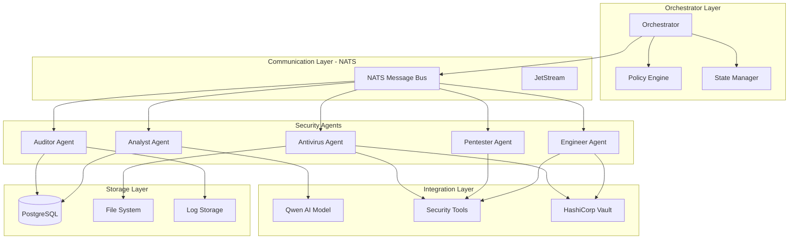
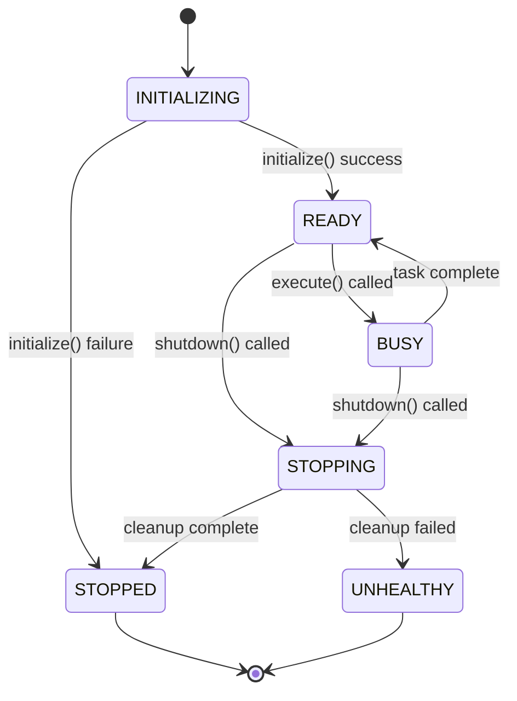
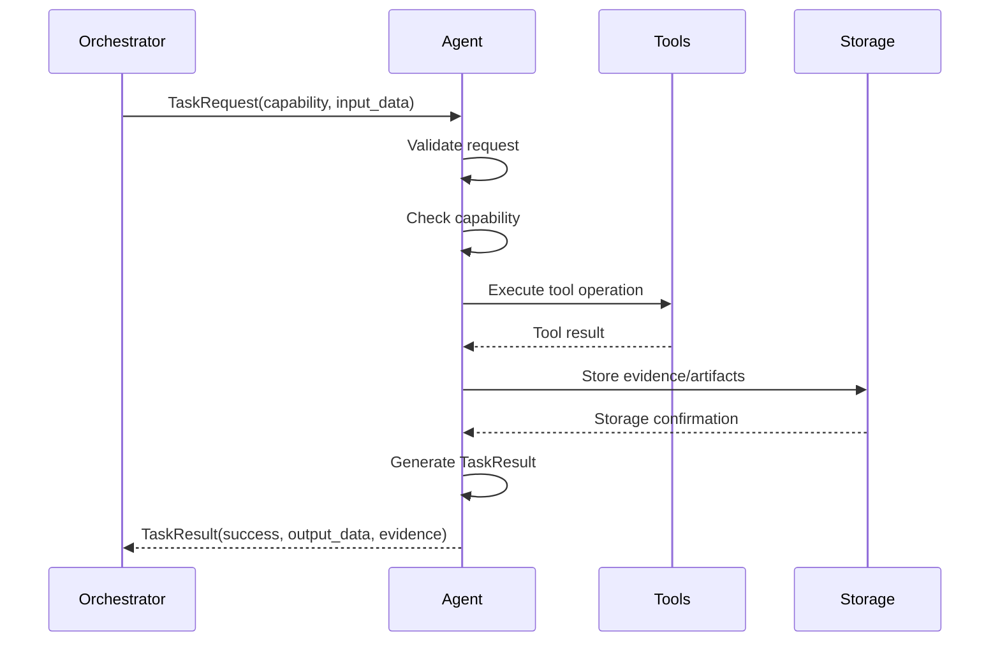
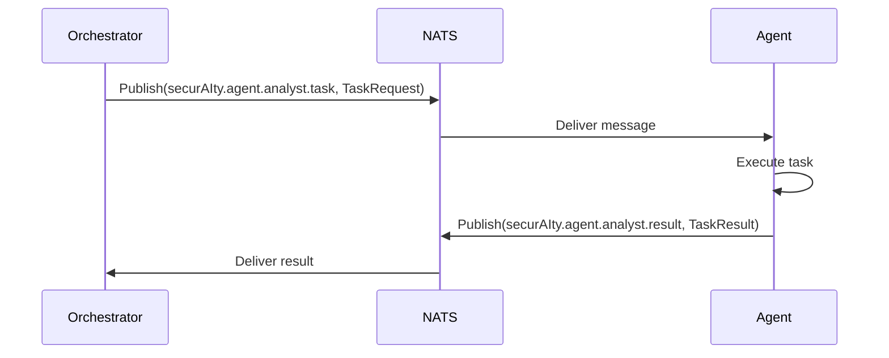
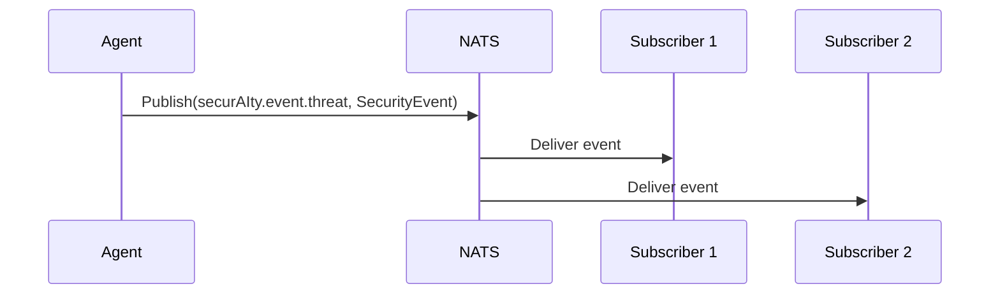
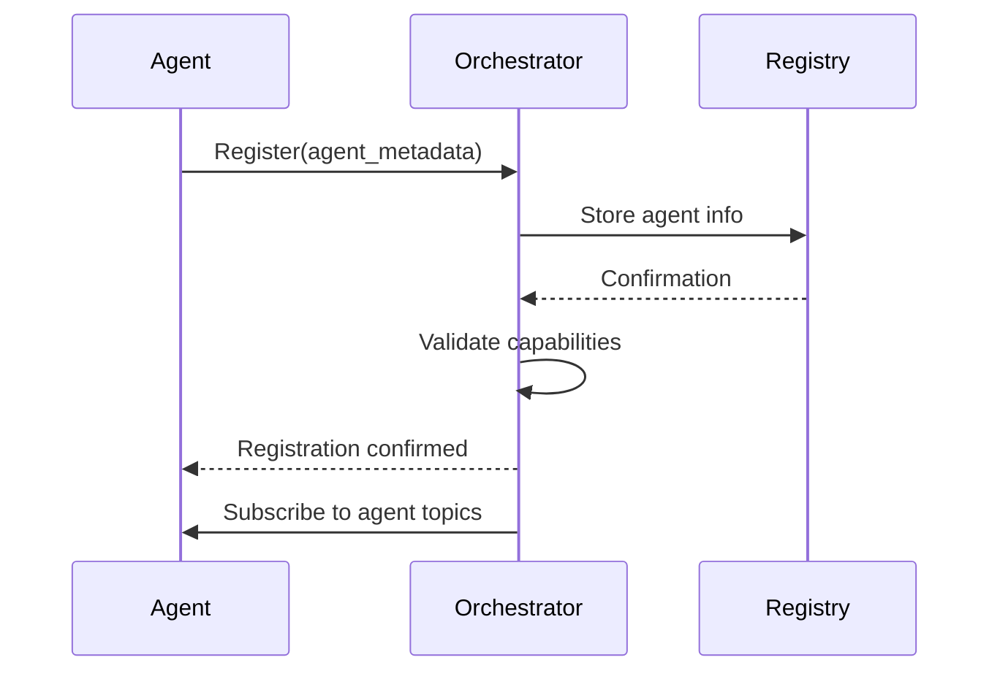
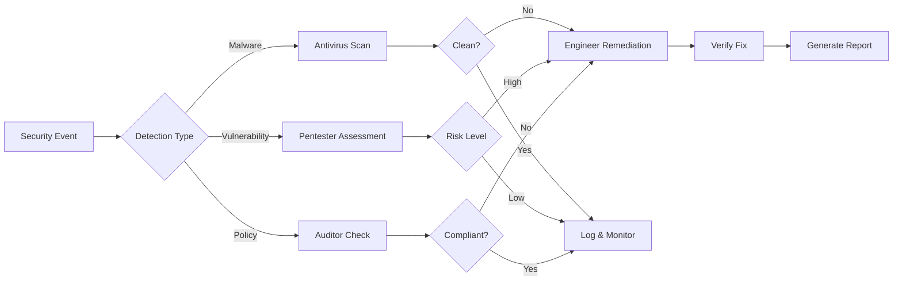
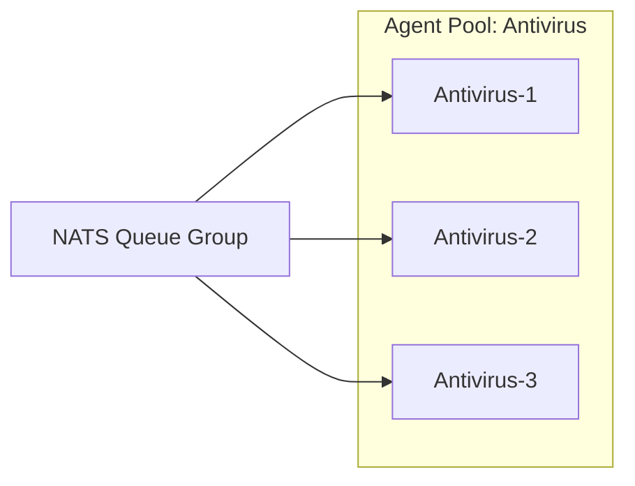
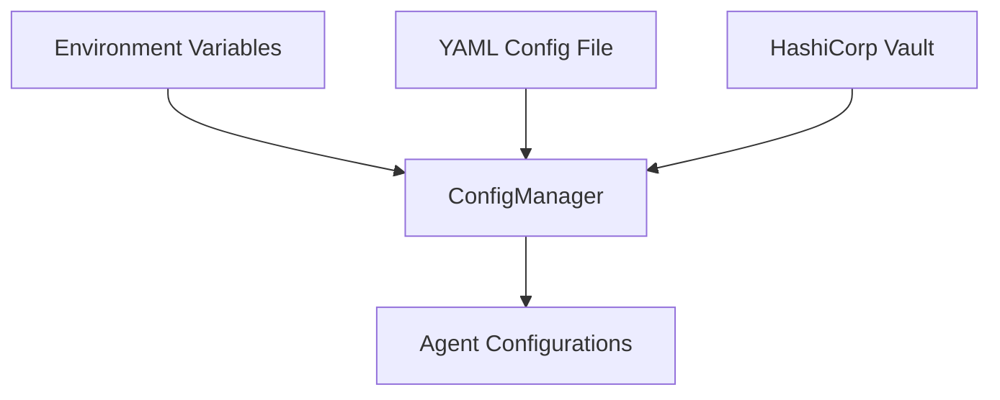

# Multi-Agent System Architecture

**Version:** 2.0.0  
**Last Updated:** March 26, 2026

## Overview

securAIty employs a multi-agent architecture where specialized AI agents collaborate through a central orchestrator to provide comprehensive cybersecurity operations. Each agent is designed for a specific security domain, enabling focused expertise and autonomous operation within defined boundaries.

### System Components



### Key Design Principles

1. **Separation of Concerns**: Each agent has a single, well-defined security domain
2. **Autonomous Operation**: Agents can operate independently within their scope
3. **Centralized Coordination**: Orchestrator manages cross-agent workflows
4. **Event-Driven Communication**: Loose coupling via NATS message bus
5. **Health Monitoring**: Continuous health checks and status reporting
6. **Secure by Design**: All communications encrypted, secrets via Vault

---

## Agent Lifecycle

### State Machine



### Lifecycle Phases

#### 1. Initialization

```python
async def initialize(self) -> None:
    """
    Initialize agent resources.
    
    - Load configuration
    - Set up connections (NATS, tools, databases)
    - Register capabilities
    - Perform health checks
    - Update status to HEALTHY
    """
```

**Initialization Sequence:**

| Step | Action | Validation |
|------|--------|------------|
| 1 | Load configuration | Config schema validation |
| 2 | Create quarantine/resources | Directory permissions check |
| 3 | Load rules/signatures | YARA rules, policy files |
| 4 | Connect to NATS | Connection test |
| 5 | Register capabilities | Capability schema validation |
| 6 | Health self-check | All components healthy |

#### 2. Execution

```python
async def execute(self, request: TaskRequest) -> TaskResult:
    """
    Execute a task request.
    
    Args:
        request: TaskRequest with capability and input data
        
    Returns:
        TaskResult with success status and output data
    """
```

**Execution Flow:**



#### 3. Health Check

```python
async def health_check(self) -> HealthStatus:
    """
    Perform health check.
    
    Returns:
        HealthStatus: HEALTHY, DEGRADED, or UNHEALTHY
    """
```

**Health Status Definitions:**

| Status | Description | Action |
|--------|-------------|--------|
| `HEALTHY` | All components operational | Continue normal operation |
| `DEGRADED` | Non-critical component failure | Log warning, continue with reduced capacity |
| `UNHEALTHY` | Critical component failure | Alert orchestrator, stop accepting tasks |
| `UNKNOWN` | Health check not yet performed | Initialize or re-initialize |

#### 4. Shutdown

```python
async def shutdown(self) -> None:
    """
    Gracefully shutdown agent.
    
    - Stop accepting new tasks
    - Complete in-progress tasks (with timeout)
    - Close connections
    - Clean up resources
    - Update status to STOPPED
    """
```

---

## Communication Patterns

### NATS Message Bus

All inter-component communication flows through NATS with JetStream for persistence.

#### Connection Configuration

```yaml
nats:
  servers:
    - "nats://localhost:4222"
  queue_group: "securAIty_events"
  max_reconnect_attempts: 10
  reconnect_delay: 2.0
  connection_timeout: 5.0
  jetstream_enabled: true
  jetstream_stream: "SECURITY_EVENTS"
```

#### Subject Hierarchy

```
securAIty.orchestrator.>          # Orchestrator commands
securAIty.agent.>                 # Agent communications
securAIty.agent.{agent_id}.task   # Task dispatch
securAIty.agent.{agent_id}.result # Task results
securAIty.agent.{agent_id}.health # Health updates
securAIty.event.>                 # Security events
securAIty.event.threat            # Threat detection events
securAIty.event.vulnerability     # Vulnerability events
securAIty.event.compliance        # Compliance events
```

#### Message Patterns

**Request-Reply Pattern:**



**Pub-Sub Event Pattern:**



### Task Request Structure

```python
@dataclass
class TaskRequest:
    task_id: str = field(default_factory=lambda: str(uuid.uuid4()))
    capability: str  # e.g., "scan_file", "vulnerability_scan"
    input_data: dict[str, Any] = field(default_factory=dict)
    priority: TaskPriority = TaskPriority.NORMAL
    correlation_id: str = field(default_factory=lambda: str(uuid.uuid4()))
    timeout: Optional[float] = None
```

### Task Result Structure

```python
@dataclass
class TaskResult:
    task_id: str
    success: bool
    output_data: dict[str, Any] = field(default_factory=dict)
    error_message: str = ""
    execution_time_ms: float = 0.0
    evidence: list[dict[str, Any]] = field(default_factory=list)
    timestamp: datetime = field(default_factory=datetime.utcnow)
```

---

## Orchestrator Integration

### Agent Registration

Agents register with the orchestrator during initialization:



### Capability Discovery

The orchestrator maintains a capability registry:

```python
# Agent metadata with capabilities
metadata = AgentMetadata(
    agent_id="analyst_001",
    agent_type="analyst",
    version="2.0.0",
    capabilities=[
        AgentCapability(
            name="event_analysis",
            description="Analyze and triage security events",
            input_schema={...},
            output_schema={...},
            timeout=30.0,
        ),
        # ... more capabilities
    ],
)
```

### Workflow Orchestration



---

## Agent Registration and Discovery

### Registration Process

1. **Agent Initialization**: Agent creates metadata with capabilities
2. **Orchestrator Discovery**: Agent connects to orchestrator via NATS
3. **Capability Publication**: Agent publishes available capabilities
4. **Validation**: Orchestrator validates capability schemas
5. **Subscription Setup**: Orchestrator subscribes to agent topics
6. **Health Monitoring**: Health check loop initiated

### Service Discovery Table

| Agent Type | Agent ID Pattern | Capabilities | NATS Subject |
|------------|-----------------|--------------|--------------|
| Analyst | `analyst_{uuid}` | event_analysis, incident_investigation, threat_correlation | `securAIty.agent.analyst.*` |
| Antivirus | `antivirus_{uuid}` | scan_file, scan_directory, quarantine_file | `securAIty.agent.antivirus.*` |
| Pentester | `pentester_{uuid}` | vulnerability_scan, exploitation_testing | `securAIty.agent.pentester.*` |
| Engineer | `engineer_{uuid}` | automated_remediation, patch_management | `securAIty.agent.engineer.*` |
| Auditor | `auditor_{uuid}` | compliance_auditing, control_assessment | `securAIty.agent.auditor.*` |

### Dynamic Scaling

Multiple instances of the same agent type can run concurrently:



Tasks are distributed via NATS queue groups using round-robin delivery.

---

## Configuration Management

### Configuration Hierarchy



### Agent Configuration Schema

```yaml
agent:
  max_concurrent_tasks: 10      # Maximum parallel tasks
  task_timeout: 300.0           # Default timeout in seconds
  max_retries: 3                # Retry attempts on failure
  enable_logging: true          # Enable agent logging
  log_level: "INFO"             # Logging verbosity
```

### Environment Variable Overrides

```bash
# Global settings
SECURAITY_ENV=production
SECURAITY_DEBUG=false
SECURAITY_LOG_LEVEL=INFO

# Agent-specific
SECURAITY_AGENT_MAX_CONCURRENT_TASKS=10
SECURAITY_AGENT_TASK_TIMEOUT=300

# NATS configuration
SECURAITY_NATS_SERVERS=nats://node1:4222,nats://node2:4222
SECURAITY_NATS_QUEUE_GROUP=securAIty_events
```

### Configuration Loading Order

1. Default values (code)
2. YAML configuration file
3. Environment variables
4. Vault secrets (for sensitive data)

### Runtime Configuration Updates

```python
from securAIty.utils.config import get_config, reload_config

# Get current configuration
config = get_config()

# Access agent configuration
agent_config = config.get_agent_config()
max_tasks = agent_config.max_concurrent_tasks

# Reload from file (e.g., after config change)
reload_config("/path/to/config.yaml")
```

---

## Security Considerations

### Communication Security

- **Encryption**: All NATS communications use TLS 1.3+
- **Authentication**: Agent-to-orchestrator authentication via API keys
- **Authorization**: Role-based access control for capabilities
- **Audit Logging**: All inter-agent communications logged

### Data Protection

- **Encryption at Rest**: Evidence and artifacts encrypted with AES-256-GCM
- **Secure Quarantine**: Quarantined files encrypted with unique keys
- **Secret Management**: All secrets via HashiCorp Vault
- **Key Rotation**: Automatic key rotation every 90 days

### Agent Isolation

- **Process Isolation**: Each agent runs in separate container
- **Resource Limits**: CPU and memory limits per agent
- **Network Policies**: Restricted network access per agent type
- **Capability Boundaries**: Agents cannot execute outside defined capabilities

---

## Monitoring and Observability

### Health Endpoints

Each agent exposes health status via NATS:

```
Subject: securAIty.agent.{agent_id}.health
Message: {
    "agent_id": "analyst_001",
    "status": "healthy",
    "uptime_seconds": 3600,
    "tasks_completed": 150,
    "last_health_check": "2026-03-26T10:00:00Z"
}
```

### Metrics Collection

| Metric | Type | Description |
|--------|------|-------------|
| `agent.tasks.total` | Counter | Total tasks executed |
| `agent.tasks.success` | Counter | Successful task completions |
| `agent.tasks.failed` | Counter | Failed task attempts |
| `agent.tasks.duration_ms` | Histogram | Task execution time |
| `agent.health.status` | Gauge | Current health status |
| `agent.queue.depth` | Gauge | Pending task queue size |

### Logging Format

```json
{
    "timestamp": "2026-03-26T10:00:00Z",
    "level": "INFO",
    "agent_id": "analyst_001",
    "agent_type": "analyst",
    "task_id": "task_12345",
    "capability": "event_analysis",
    "message": "Task completed successfully",
    "execution_time_ms": 245.6,
    "correlation_id": "corr_67890"
}
```

---

## Troubleshooting

### Common Issues

#### Agent Fails to Initialize

**Symptoms:**
- Agent status remains `UNKNOWN`
- Health check returns `UNHEALTHY`

**Resolution:**
```bash
# Check agent logs
docker logs securAIty-agent-analyst-1

# Verify NATS connectivity
nats sub "securAIty.>"

# Validate configuration
python -c "from securAIty.utils.config import get_config; print(get_config().to_dict())"
```

#### Task Timeout

**Symptoms:**
- TaskResult not received within timeout
- Orchestrator reports task failure

**Resolution:**
1. Check agent resource utilization (CPU, memory)
2. Verify external tool connectivity (ClamAV, YARA)
3. Increase timeout in agent configuration
4. Review task input data size

#### Communication Failures

**Symptoms:**
- NATS connection errors
- Messages not delivered

**Resolution:**
```bash
# Check NATS server status
docker-compose ps nats

# Verify NATS configuration
echo $SECURAITY_NATS_SERVERS

# Test NATS connectivity
nats pub securAIty.test "test message"
```

### Health Check Debugging

```python
# Manual health check
from securAIty.agents.analyst import AnalystAgent

agent = AnalystAgent()
await agent.initialize()
status = await agent.health_check()
print(f"Health status: {status}")
await agent.shutdown()
```

---

## Related Documentation

- [Analyst Agent](analyst.md) - Security event analysis and incident investigation
- [Antivirus Agent](antivirus.md) - Malware detection and response
- [Pentester Agent](pentester.md) - Vulnerability assessment and testing
- [Auditor Agent](auditor.md) - Compliance auditing and reporting
- [Engineer Agent](engineer.md) - Security remediation and automation

---

## References

- [OpenAPI Specification](../api/openapi.yaml) - API endpoint documentation
- [Architecture Decision Records](../adr/) - Design decisions and rationale
- [Security Runbooks](../runbooks/) - Operational procedures
