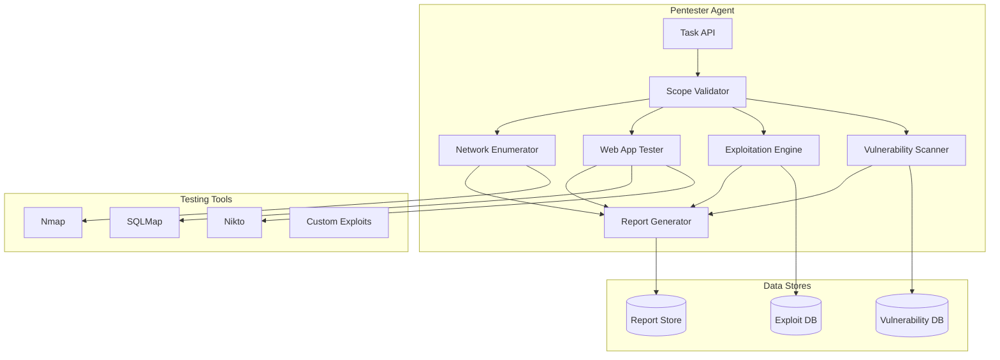
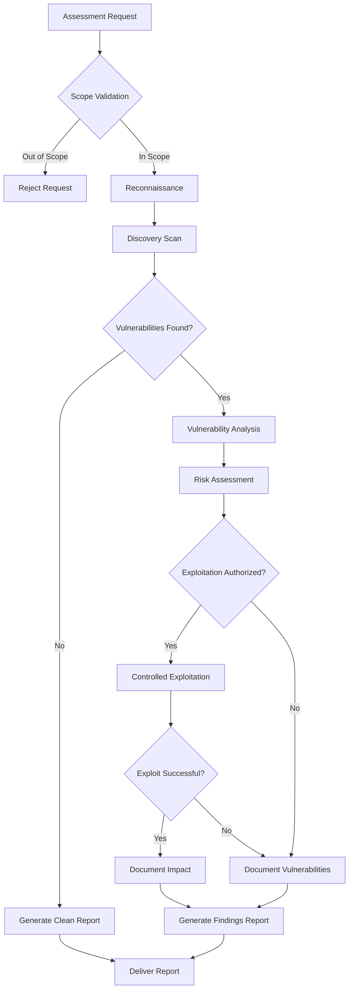
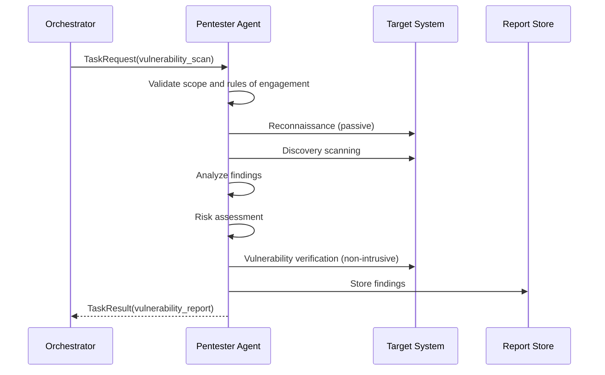
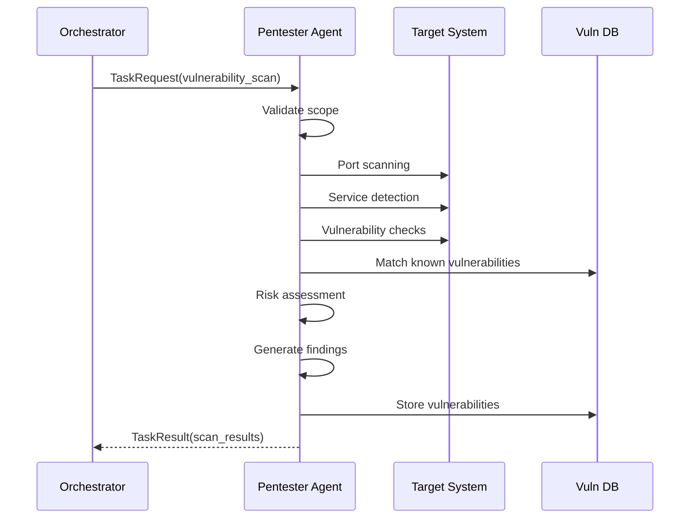
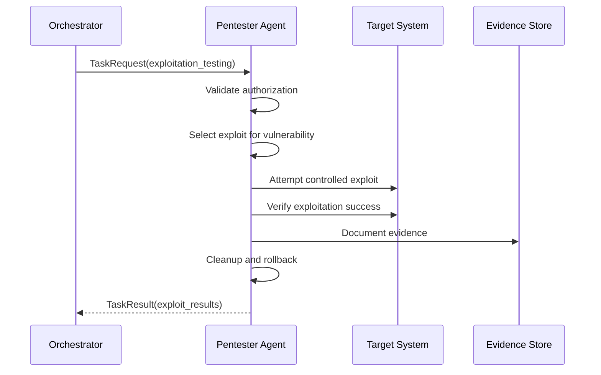

# Penetration Testing Agent

**Author:** CertifiedSlop

**Agent Type:** `pentester`  
**Version:** 2.0.0  
**Status:** Production Ready

## Purpose and Capabilities

The Penetration Testing Agent (Pentester Agent) provides automated security assessment capabilities for the securAIty platform. It performs vulnerability discovery, exploitation simulation, and comprehensive security testing to identify weaknesses before malicious actors can exploit them.

### Primary Capabilities

| Capability | Description | Priority |
|------------|-------------|----------|
| `vulnerability_scanning` | Discover and catalog vulnerabilities | 10 |
| `exploitation_testing` | Simulate exploitation attempts | 20 |
| `web_app_testing` | Test web application security | 30 |
| `network_enumeration` | Enumerate network services and hosts | 40 |
| `privilege_escalation` | Test privilege escalation vectors | 50 |
| `report_generation` | Generate comprehensive security reports | 60 |

### Testing Methodologies

The agent follows industry-standard testing methodologies:

- **OWASP Testing Guide**: Web application security testing
- **PTES (Penetration Testing Execution Standard)**: Full engagement lifecycle
- **NIST SP 800-115**: Technical security testing guidelines
- **OSSTMM (Open Source Security Testing Methodology Manual)**: Comprehensive testing

### Use Cases

- **Continuous Security Assessment**: Regular automated vulnerability scanning
- **Pre-Deployment Testing**: Security validation before production release
- **Compliance Testing**: Meet regulatory security assessment requirements
- **Incident Investigation**: Post-incident vulnerability analysis
- **Security Baseline**: Establish security posture baseline

---

## Architecture

### Component Diagram



### Testing Workflow



### Engagement Lifecycle



---

## Configuration

### Agent Configuration

```yaml
pentester:
  agent_id: "pentester_001"
  name: "AI Self-Pentester Agent"
  description: "Automated penetration testing and vulnerability assessment"
  max_concurrent_tasks: 5
  task_timeout: 600.0
  
  # Scanning configuration
  scanning:
    max_targets: 100
    scan_timeout: 300
    rate_limit: 100  # packets per second
    parallel_hosts: 10
    
  # Exploitation configuration
  exploitation:
    enabled: true
    max_attempts: 3
    safe_mode: true  # Non-destructive exploits only
    rollback_enabled: true
    
  # Scope configuration
  scope:
    allowed_networks:
      - "10.0.0.0/8"
      - "172.16.0.0/12"
      - "192.168.0.0/16"
    denied_hosts:
      - "10.0.0.1"  # Gateway
      - "10.0.0.2"  # DNS
    allowed_ports:
      - 22
      - 80
      - 443
      - 3306
      - 5432
      
  # Reporting configuration
  reporting:
    include_evidence: true
    include_recommendations: true
    cvss_version: "3.1"
```

### Environment Variables

```bash
# Pentester Agent Configuration
SECURAITY_PENTESTER_MAX_CONCURRENT_TASKS=5
SECURAITY_PENTESTER_TASK_TIMEOUT=600
SECURAITY_PENTESTER_LOG_LEVEL=INFO

# Scanning Configuration
PENTESTER_SCAN_TIMEOUT=300
PENTESTER_RATE_LIMIT=100
PENTESTER_PARALLEL_HOSTS=10

# Exploitation Configuration
PENTESTER_EXPLOITATION_ENABLED=true
PENTESTER_SAFE_MODE=true

# Scope Configuration
PENTESTER_ALLOWED_NETWORKS=10.0.0.0/8,172.16.0.0/12,192.168.0.0/16
PENTESTER_DENIED_HOSTS=10.0.0.1,10.0.0.2

# Tool Configuration
NMAP_PATH=/usr/bin/nmap
NIKTO_PATH=/usr/share/nikto/nikto.pl
SQLMAP_PATH=/usr/share/sqlmap/sqlmap.py
```

### NATS Subjects

| Subject | Direction | Description |
|---------|-----------|-------------|
| `securAIty.agent.pentester.task` | Inbound | Task requests from orchestrator |
| `securAIty.agent.pentester.result` | Outbound | Assessment results |
| `securAIty.agent.pentester.health` | Outbound | Health status updates |
| `securAIty.agent.pentester.finding` | Outbound | Vulnerability findings |

---

## Event Types Handled

### Assessment Request Events

| Event Type | Description | Input Schema |
|------------|-------------|--------------|
| `VULNERABILITY_SCAN_REQUEST` | Request vulnerability scan | `{target, scope, scan_type}` |
| `EXPLOITATION_TEST_REQUEST` | Request exploit testing | `{target, vulnerability_id}` |
| `WEB_APP_TEST_REQUEST` | Request web app testing | `{url, test_types}` |
| `NETWORK_SCAN_REQUEST` | Request network enumeration | `{host, port_range}` |

### Assessment Result Events

| Event Type | Description | Output Schema |
|------------|-------------|---------------|
| `VULNERABILITY_SCAN_RESULT` | Scan completion | `{target, vulnerabilities, summary}` |
| `EXPLOITATION_RESULT` | Exploit test result | `{vulnerability_id, success, evidence}` |
| `WEB_APP_TEST_RESULT` | Web test results | `{url, findings, risk_level}` |
| `NETWORK_ENUM_RESULT` | Enumeration results | `{host, ports, services}` |

### Vulnerability Severity Classification

| Severity | CVSS Range | Response Time | Description |
|----------|------------|---------------|-------------|
| CRITICAL | 9.0-10.0 | Immediate (< 24h) | Actively exploitable, high impact |
| HIGH | 7.0-8.9 | Urgent (< 7 days) | Easily exploitable, significant impact |
| MEDIUM | 4.0-6.9 | Standard (< 30 days) | Requires conditions, moderate impact |
| LOW | 0.1-3.9 | Scheduled (< 90 days) | Difficult to exploit, low impact |
| INFO | 0.0 | As needed | Informational finding |

---

## Vulnerability Categories

### OWASP Top 10 Coverage

| Category | ID | Description | Detection Method |
|----------|-----|-------------|------------------|
| Injection | A01 | SQL, NoSQL, OS, LDAP injection | Input validation testing |
| Broken Authentication | A02 | Session management flaws | Auth bypass testing |
| Sensitive Data Exposure | A03 | Data protection failures | Encryption analysis |
| XML External Entities | A04 | XXE vulnerabilities | XML parsing tests |
| Broken Access Control | A05 | Authorization bypass | Privilege escalation tests |
| Security Misconfiguration | A06 | Insecure configurations | Configuration audit |
| Cross-Site Scripting | A07 | XSS vulnerabilities | Input/output testing |
| Insecure Deserialization | A08 | Deserialization flaws | Object injection tests |
| Using Components with Known Vulnerabilities | A09 | Outdated components | Version scanning |
| Insufficient Logging & Monitoring | A10 | Missing audit trails | Log analysis |

### Vulnerability Data Model

```python
@dataclass
class Vulnerability:
    vuln_id: str                    # Unique identifier
    name: str                        # Vulnerability name
    severity: VulnerabilitySeverity  # CRITICAL, HIGH, MEDIUM, LOW, INFO
    cvss_score: float                # CVSS score 0-10
    category: str                    # Vulnerability category
    location: str                    # Affected location
    description: str                 # Detailed description
    evidence: list[str]              # Supporting evidence
    remediation: str                 # Remediation recommendation
    cwe_id: str                      # CWE identifier
    cve_id: str                      # CVE identifier (if known)
```

---

## Example Workflows

### Workflow 1: Vulnerability Scan



**Example Request:**

```json
{
    "task_id": "task_pt_001",
    "capability": "vulnerability_scan",
    "input_data": {
        "target": {
            "host": "192.168.1.100",
            "url": "https://app.example.com"
        },
        "scope": {
            "network": "192.168.1.0/24",
            "ports": "1-65535",
            "tests": ["injection", "auth", "xss", "misconfig"]
        }
    }
}
```

**Example Response:**

```json
{
    "task_id": "task_pt_001",
    "success": true,
    "output_data": {
        "scan_type": "vulnerability_scan",
        "target": "192.168.1.100",
        "vulnerabilities": [
            {
                "vuln_id": "vuln_001",
                "name": "SQL Injection in Login Form",
                "severity": "HIGH",
                "cvss_score": 8.5,
                "category": "injection",
                "location": "https://app.example.com/login",
                "description": "SQL injection vulnerability in username parameter",
                "evidence": [
                    "Error-based SQL injection confirmed",
                    "Payload: ' OR '1'='1"
                ],
                "remediation": "Use parameterized queries and input validation",
                "cwe_id": "CWE-89"
            },
            {
                "vuln_id": "vuln_002",
                "name": "Missing Security Headers",
                "severity": "LOW",
                "cvss_score": 3.5,
                "category": "security_misconfiguration",
                "location": "https://app.example.com",
                "description": "Missing X-Frame-Options and CSP headers",
                "evidence": [
                    "X-Frame-Options header not present",
                    "Content-Security-Policy header not present"
                ],
                "remediation": "Implement security headers",
                "cwe_id": "CWE-16"
            }
        ],
        "summary": {
            "total_vulnerabilities": 2,
            "critical": 0,
            "high": 1,
            "medium": 0,
            "low": 1,
            "info": 0
        }
    },
    "execution_time_ms": 45678.9,
    "timestamp": "2026-03-26T11:00:00Z"
}
```

### Workflow 2: Exploitation Testing



**Example Request:**

```json
{
    "task_id": "task_pt_002",
    "capability": "exploitation_testing",
    "input_data": {
        "target": {
            "host": "192.168.1.100",
            "vulnerability_id": "vuln_001"
        },
        "exploit_params": {
            "safe_mode": true,
            "rollback": true
        }
    }
}
```

**Example Response:**

```json
{
    "task_id": "task_pt_002",
    "success": true,
    "output_data": {
        "test_type": "exploitation",
        "target": "192.168.1.100",
        "attempts": [
            {
                "vulnerability_id": "vuln_001",
                "exploit_used": "SQL Injection - Authentication Bypass",
                "success": true,
                "access_gained": "authentication_bypass",
                "evidence": [
                    "Login bypassed with payload: ' OR '1'='1",
                    "Session cookie obtained: session=abc123"
                ],
                "risk_level": "high",
                "impact": "Full authentication bypass possible"
            }
        ],
        "successful_exploits": 1,
        "cleanup_status": "completed"
    },
    "execution_time_ms": 12345.6,
    "timestamp": "2026-03-26T11:05:00Z"
}
```

### Workflow 3: Web Application Testing

**Example Request:**

```json
{
    "task_id": "task_pt_003",
    "capability": "web_app_testing",
    "input_data": {
        "target": {
            "url": "https://app.example.com",
            "crawl_depth": 3
        },
        "scope": {
            "tests": ["sql_injection", "xss", "csrf", "auth_bypass"],
            "exclude_paths": ["/logout", "/admin"]
        }
    }
}
```

**Example Response:**

```json
{
    "task_id": "task_pt_003",
    "success": true,
    "output_data": {
        "test_type": "web_application",
        "target": "https://app.example.com",
        "tests_performed": [
            "sql_injection",
            "xss",
            "csrf",
            "auth_bypass",
            "session_management"
        ],
        "findings": [
            {
                "type": "csrf",
                "location": "https://app.example.com/transfer",
                "severity": "MEDIUM",
                "description": "Missing CSRF token on fund transfer form",
                "evidence": "Form submission accepted without valid CSRF token"
            },
            {
                "type": "session",
                "location": "https://app.example.com",
                "severity": "LOW",
                "description": "Weak session ID generation",
                "evidence": "Session IDs predictable based on timestamp"
            }
        ]
    },
    "execution_time_ms": 67890.1,
    "timestamp": "2026-03-26T11:10:00Z"
}
```

### Workflow 4: Network Enumeration

**Example Request:**

```json
{
    "task_id": "task_pt_004",
    "capability": "network_enumeration",
    "input_data": {
        "target": {
            "host": "192.168.1.0/24",
            "port_range": "1-1000"
        }
    }
}
```

**Example Response:**

```json
{
    "task_id": "task_pt_004",
    "success": true,
    "output_data": {
        "test_type": "network_enumeration",
        "target": "192.168.1.0/24",
        "ports_scanned": "1-1000",
        "hosts_discovered": 15,
        "open_ports": [
            {"host": "192.168.1.1", "port": 22, "service": "ssh", "version": "OpenSSH 8.2"},
            {"host": "192.168.1.1", "port": 80, "service": "http", "version": "nginx 1.18.0"},
            {"host": "192.168.1.10", "port": 443, "service": "https", "version": "Apache 2.4.41"},
            {"host": "192.168.1.20", "port": 3306, "service": "mysql", "version": "MySQL 8.0"}
        ],
        "services": ["ssh", "http", "https", "mysql"],
        "vulnerabilities": [
            {
                "vuln_id": "net_001",
                "name": "Service Version Exposure - MySQL",
                "severity": "LOW",
                "cvss_score": 3.5,
                "description": "MySQL version banner exposed",
                "remediation": "Hide service version banners"
            }
        ]
    },
    "execution_time_ms": 123456.7,
    "timestamp": "2026-03-26T11:15:00Z"
}
```

---

## Scanning Tools Integration

### Nmap Integration

```python
async def run_nmap_scan(target: str, ports: str = "1-1000") -> dict[str, Any]:
    """Execute Nmap port scan."""
    cmd = [
        "nmap",
        "-sV",           # Version detection
        "-sC",           # Default scripts
        "-oX",           # XML output
        "-p", ports,
        "--max-rate", "100",
        target
    ]
    
    process = await asyncio.create_subprocess_exec(
        *cmd,
        stdout=asyncio.subprocess.PIPE,
        stderr=asyncio.subprocess.PIPE
    )
    
    stdout, stderr = await process.communicate()
    
    # Parse XML output
    return parse_nmap_xml(stdout)
```

### SQLMap Integration

```python
async def test_sql_injection(url: str, params: dict[str, str]) -> dict[str, Any]:
    """Test for SQL injection using SQLMap."""
    cmd = [
        "sqlmap",
        "-u", url,
        "--data", urlencode(params),
        "--batch",
        "--level", "2",
        "--risk", "2",
        "--output-format", "json"
    ]
    
    process = await asyncio.create_subprocess_exec(
        *cmd,
        stdout=asyncio.subprocess.PIPE,
        stderr=asyncio.subprocess.PIPE
    )
    
    stdout, stderr = await process.communicate()
    
    return parse_sqlmap_output(stdout)
```

### Nikto Integration

```python
async def run_nikto_scan(target_url: str) -> dict[str, Any]:
    """Execute Nikto web server scan."""
    cmd = [
        "nikto",
        "-h", target_url,
        "-Format", "json",
        "-timeout", "300",
        "-no404"
    ]
    
    process = await asyncio.create_subprocess_exec(
        *cmd,
        stdout=asyncio.subprocess.PIPE,
        stderr=asyncio.subprocess.PIPE
    )
    
    stdout, stderr = await process.communicate()
    
    return json.loads(stdout) if stdout else {}
```

---

## Ethical Considerations

### Rules of Engagement

Before any penetration testing activity, the following must be confirmed:

1. **Written Authorization**: Explicit authorization from system owner
2. **Defined Scope**: Clear boundaries of testing targets
3. **Time Window**: Approved testing timeframes
4. **Emergency Contacts**: Point of contact for issues
5. **Rollback Plan**: Procedure to restore systems if needed

### Safe Testing Practices

```python
# Safe mode enforcement
SAFE_EXPLOIT_CONFIG = {
    "destructive_exploits": False,      # No destructive payloads
    "data_modification": False,          # No data modification
    "dos_exploits": False,               # No DoS testing
    "social_engineering": False,         # No social engineering
    "physical_testing": False,           # No physical security tests
    "persistence": False,                # No persistent access
    "credential_harvesting": False,      # No credential collection
}
```

### Compliance Requirements

| Standard | Requirement | Implementation |
|----------|-------------|----------------|
| PTES | Pre-engagement interactions | Scope validation before testing |
| NIST 800-115 | Authorization | Written authorization required |
| OSSTMM | Rules of engagement | Defined RoE document |
| GDPR | Data protection | No PII collection during tests |

### Prohibited Activities

The following activities are **strictly prohibited**:

- Testing systems outside defined scope
- Denial of Service (DoS) attacks
- Social engineering without explicit authorization
- Physical security testing
- Data exfiltration beyond proof-of-concept
- Installing persistent backdoors
- Testing production systems during business hours without approval

---

## Troubleshooting

### Issue: Scan Timeout

**Symptoms:**
- Task fails with timeout error
- Partial results returned

**Diagnosis:**
```bash
# Check target responsiveness
ping -c 4 <target_host>

# Test network connectivity
nmap -sn <target_host>

# Check agent resources
docker stats securAIty-agent-pentester-1
```

**Resolution:**
1. Increase `task_timeout` in configuration
2. Reduce scan scope (fewer hosts/ports)
3. Increase rate limit if network allows
4. Split into multiple smaller scans

### Issue: False Positive Vulnerabilities

**Symptoms:**
- Reported vulnerabilities don't exist
- Manual verification shows no issue

**Resolution:**
```yaml
# Adjust vulnerability verification
pentester:
  verification:
    require_multiple_methods: true
    manual_review_threshold: 7.0  # CVSS
    exclude_cve_patterns:
      - "CVE-2020-*"  # Exclude old CVEs if needed
```

### Issue: Target System Instability

**Symptoms:**
- Target system becomes unresponsive during scan
- Service degradation reported

**Resolution:**
```yaml
# Reduce scan intensity
pentester:
  scanning:
    rate_limit: 50      # Reduce from 100
    parallel_hosts: 5   # Reduce from 10
    scan_timeout: 600   # Increase timeout
```

### Issue: Scope Violation Warning

**Symptoms:**
- Agent reports scope violations
- Scan stops prematurely

**Resolution:**
```yaml
# Review and adjust scope
pentester:
  scope:
    allowed_networks:
      - "10.0.0.0/8"
      - "192.168.0.0/16"
    # Add missing networks
    allowed_networks:
      - "10.0.0.0/8"
      - "172.16.0.0/12"
      - "192.168.0.0/16"
      - "10.10.0.0/16"  # Add test network
```

### Debug Mode

Enable detailed logging for troubleshooting:

```yaml
pentester:
  log_level: "DEBUG"
  logging:
    include_requests: true
    include_responses: true
    save_evidence: true
```

```bash
# View debug logs
docker logs --tail 1000 securAIty-agent-pentester-1 | grep DEBUG
```

---

## Security Considerations

### Agent Security

- **Isolation**: Agent runs in isolated container with limited network access
- **Authentication**: All agent communications authenticated via API keys
- **Authorization**: Role-based access to pentesting capabilities
- **Audit Logging**: All scanning activities logged with timestamps

### Data Protection

- **Evidence Encryption**: All collected evidence encrypted at rest
- **Secure Storage**: Findings stored in encrypted database
- **Retention**: Scan results retained for 1 year, then securely deleted
- **Access Control**: Findings accessible only to authorized personnel

### Network Security

- **Egress Filtering**: Agent can only scan approved network ranges
- **Rate Limiting**: Outbound scan traffic rate-limited
- **Protocol Restrictions**: Only approved protocols used
- **Time-based Controls**: Scanning restricted to approved time windows

---

## Metrics and Monitoring

### Key Metrics

| Metric | Type | Description | Alert Threshold |
|--------|------|-------------|-----------------|
| `pentester.scans.total` | Counter | Total scans performed | - |
| `pentester.vulnerabilities.found` | Counter | Vulnerabilities discovered | - |
| `pentester.exploits.success` | Counter | Successful exploitations | - |
| `pentester.scan.duration_ms` | Histogram | Scan duration | p99 > 5min |
| `pentester.scope.violations` | Counter | Scope violations | > 0 |

### Health Indicators

| Indicator | Healthy | Degraded | Unhealthy |
|-----------|---------|----------|-----------|
| Tool Availability | All tools ready | Some tools missing | Tools unavailable |
| Scan Queue | < 10 | 10-50 | > 50 |
| Success Rate | > 95% | 80-95% | < 80% |
| Scope Compliance | 100% | N/A | Any violation |

---

## Related Documentation

- [Multi-Agent Overview](overview.md) - System architecture
- [Analyst Agent](analyst.md) - Vulnerability analysis integration
- [Engineer Agent](engineer.md) - Automated remediation
- [Security Runbooks](../runbooks/) - Operational procedures

---

## Changelog

### Version 2.0.0
- Added web application testing capabilities
- Enhanced exploitation framework
- Improved scope validation
- Added compliance reporting

### Version 1.0.0
- Initial release
- Basic vulnerability scanning
- Network enumeration

---

&copy; 2026 CertifiedSlop. All rights reserved.
