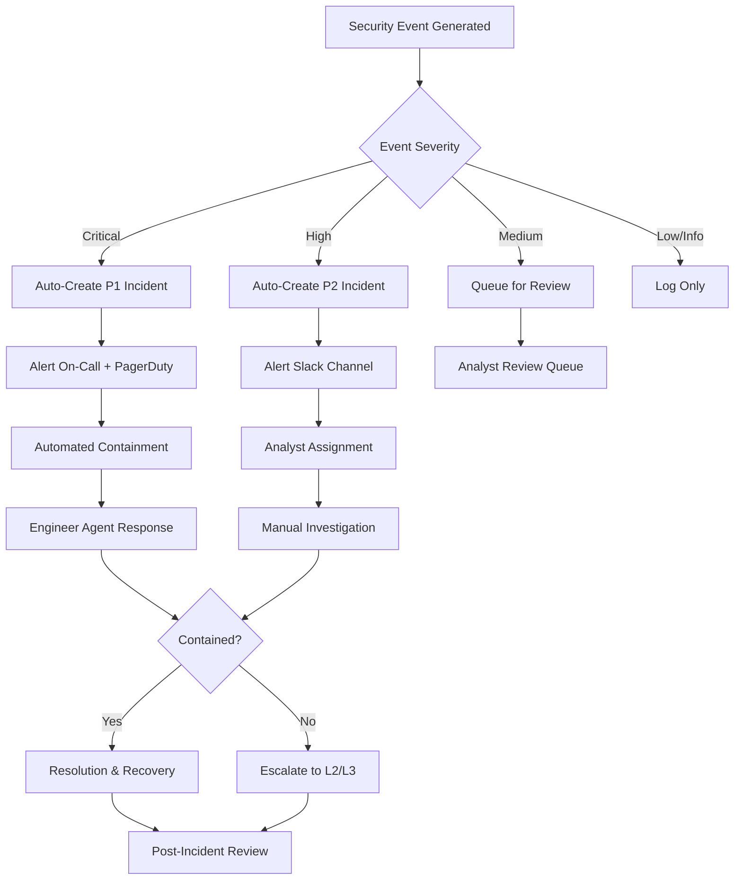

# Incident Response Runbook

**Purpose**: Procedures for responding to security incidents detected by securAIty.

**Audience**: Security team, SOC analysts, incident responders, on-call engineers

**Last Updated**: 2026-03-26

---

## Table of Contents

1. [Incident Detection Flow](#incident-detection-flow)
2. [Incident Severity Matrix](#incident-severity-matrix)
3. [Automated Agent Response](#automated-agent-response)
4. [Manual Intervention Procedures](#manual-intervention-procedures)
5. [Escalation Paths](#escalation-paths)
6. [Communication Templates](#communication-templates)
7. [Evidence Preservation](#evidence-preservation)
8. [Post-Incident Review](#post-incident-review)

---

## Incident Detection Flow



---

## Incident Severity Matrix

### Severity Definitions

| Severity | Response Time | Description | Examples |
|----------|--------------|-------------|----------|
| **P1 - Critical** | 15 minutes | Active breach, data exfiltration, ransomware | Confirmed intrusion, active malware, credential compromise |
| **P2 - High** | 1 hour | Potential breach, suspicious activity | Unusual login patterns, policy violations, failed attacks |
| **P3 - Medium** | 4 hours | Security concern, misconfiguration | Open ports, outdated software, weak passwords |
| **P4 - Low** | 24 hours | Informational, best practice | Log anomalies, minor policy deviations |

### Severity Classification Criteria

```yaml
P1_Criteria:
  - Confirmed unauthorized access to production systems
  - Active data exfiltration detected
  - Ransomware or malware infection confirmed
  - Critical system compromise (domain controller, database)
  - Credential theft of privileged accounts
  - Regulatory impact (GDPR, HIPAA breach notification required)

P2_Criteria:
  - Suspicious login from unusual location
  - Multiple failed authentication attempts
  - Policy violation with potential impact
  - Vulnerability exploitation attempt (not confirmed success)
  - Unauthorized software installation
  - Data access anomaly detected

P3_Criteria:
  - Security misconfiguration
  - Outdated software with known vulnerabilities
  - Weak password policy violation
  - Unnecessary open ports/services
  - Missing security patches (non-critical)

P4_Criteria:
  - Informational security events
  - Best practice recommendations
  - Minor policy deviations
  - Routine security scan findings
```

---

## Automated Agent Response

### Analyst Agent Actions

**Automatic Triage**:
```python
# Analyst agent automatically:
1. Correlates related events
2. Enriches with threat intelligence
3. Assigns initial severity
4. Identifies affected assets
5. Recommends response actions
```

**Event Correlation Rules**:
```yaml
correlation_rules:
  - name: "Brute Force Attack"
    condition: "failed_login_count > 5 within 5 minutes from same IP"
    severity: P2
    action: "block_ip"
    
  - name: "Data Exfiltration Pattern"
    condition: "unusual_data_volume + off_hours_access + sensitive_resource"
    severity: P1
    action: "isolate_user"
    
  - name: "Malware Detection"
    condition: "yara_match OR signature_match OR heuristic_alert"
    severity: P1
    action: "quarantine_file"
```

### Antivirus Agent Actions

**Automatic Containment**:
```python
# On malware detection:
1. Quarantine infected file
2. Block file hash globally
3. Scan related systems
4. Generate YARA rule
5. Alert security team
```

### Pentester Agent Actions

**Vulnerability Validation**:
```python
# On potential exploit detection:
1. Verify vulnerability exists
2. Check if exploitation succeeded
3. Identify attack vector
4. Recommend patch/mitigation
5. Test for similar vulnerabilities
```

### Engineer Agent Actions

**Automated Remediation**:
```python
# For confirmed incidents:
1. Isolate affected systems
2. Block malicious IPs
3. Disable compromised accounts
4. Deploy emergency patches
5. Initiate backup verification
```

**Containment Actions**:
| Action | Trigger | Approval Required |
|--------|---------|-------------------|
| Block IP | P1/P2 with high confidence | No (auto) |
| Isolate Host | P1 with malware confirmation | No (auto) |
| Disable Account | P1 with credential compromise | L2 Analyst |
| Deploy Patch | P1 with active exploitation | L3 Engineer |
| Network Segmentation | P1 with lateral movement | Security Manager |

---

## Manual Intervention Procedures

### P1 Incident Response Checklist

**Immediate Actions (0-15 minutes)**:
- [ ] Acknowledge alert in PagerDuty
- [ ] Join incident bridge call
- [ ] Review automated containment actions
- [ ] Verify incident scope
- [ ] Notify security leadership
- [ ] Begin incident timeline documentation

**Short-term Actions (15-60 minutes)**:
- [ ] Identify attack vector
- [ ] Determine affected systems/data
- [ ] Assess business impact
- [ ] Implement additional containment
- [ ] Preserve evidence
- [ ] Prepare initial status update

**Medium-term Actions (1-4 hours)**:
- [ ] Complete forensic data collection
- [ ] Identify root cause
- [ ] Develop remediation plan
- [ ] Begin recovery procedures
- [ ] Update stakeholders
- [ ] Prepare external communications (if needed)

### P2 Incident Response Checklist

**Initial Response (0-1 hour)**:
- [ ] Acknowledge alert in Slack
- [ ] Review incident details
- [ ] Validate alert accuracy
- [ ] Assign to analyst
- [ ] Begin investigation

**Investigation (1-4 hours)**:
- [ ] Collect relevant logs
- [ ] Interview affected users (if applicable)
- [ ] Determine scope
- [ ] Implement containment
- [ ] Document findings

**Resolution (4-24 hours)**:
- [ ] Complete remediation
- [ ] Verify fix effectiveness
- [ ] Update incident ticket
- [ ] Send closure notification

---

## Escalation Paths

### Escalation Matrix

| Level | Role | Contact | Response Time |
|-------|------|---------|---------------|
| **L1** | SOC Analyst (On-Call) | PagerDuty: security-oncall | 15 minutes |
| **L2** | Senior Security Engineer | PagerDuty: security-senior | 30 minutes |
| **L3** | Security Architect | Phone: +1-XXX-XXX-XXXX | 1 hour |
| **Mgmt** | Security Manager | Phone: +1-XXX-XXX-XXXX | 2 hours |
| **Exec** | CISO | Phone: +1-XXX-XXX-XXXX | 4 hours |

### Escalation Triggers

```yaml
Escalate_to_L2_when:
  - Incident severity unclear
  - Automated containment failed
  - Multiple systems affected
  - Potential data breach
  - Customer impact detected

Escalate_to_L3_when:
  - Critical infrastructure affected
  - Advanced persistent threat (APT) indicators
  - Regulatory notification may be required
  - Cross-organizational impact
  - Novel attack technique

Escalate_to_Management_when:
  - P1 incident declared
  - Media inquiry received
  - Law enforcement involvement needed
  - Significant business impact
  - Customer notification required

Escalate_to_Executive_when:
  - Material breach confirmed
  - Regulatory fines possible
  - Reputational risk high
  - Legal action anticipated
```

### Escalation Communication Template

```
Subject: [ESCALATION] Incident INC-YYYY-XXXX - {Brief Description}

Escalation Level: L{N}
Incident ID: INC-YYYY-XXXX
Severity: P{N}

Current Status:
{Brief description of current situation}

Reason for Escalation:
{Why this is being escalated}

Actions Taken So Far:
- {Action 1}
- {Action 2}
- {Action 3}

Requested Support:
{What help is needed from this level}

Next Update: {Time}
Bridge Line: {Conference details}
```

---

## Communication Templates

### Initial Status Update

```
INCIDENT STATUS UPDATE
======================

Incident ID: INC-YYYY-XXXX
Severity: P{N}
Status: {Investigating/Contained/Resolved}

Summary:
{2-3 sentence description of the incident}

Impact:
- Systems: {Affected systems}
- Users: {Number of affected users}
- Data: {Potential data impact}

Timeline:
- Detected: {Time}
- Response Started: {Time}
- Current Time: {Time}

Actions Taken:
- {Action 1}
- {Action 2}

Next Steps:
- {Planned action 1}
- {Planned action 2}

Next Update: {Time}
Incident Commander: {Name}
```

### Resolution Notification

```
INCIDENT RESOLVED
=================

Incident ID: INC-YYYY-XXXX
Severity: P{N}
Duration: {X hours Y minutes}
Status: RESOLVED

Summary:
{Description of incident and resolution}

Root Cause:
{Identified root cause}

Resolution:
{Actions taken to resolve}

Prevention:
{Steps to prevent recurrence}

Follow-up Actions:
- {Action item 1} - Owner: {Name} - Due: {Date}
- {Action item 2} - Owner: {Name} - Due: {Date}

Post-Incident Review: Scheduled for {Date/Time}
```

### External Communication (Customer-Facing)

```
SECURITY INCIDENT NOTICE

Dear {Customer},

We are writing to inform you of a security incident that may have affected 
your data. We take the security of your information seriously and want to 
provide you with transparent information about what happened.

What Happened:
{Clear, non-technical description}

When It Happened:
{Date range of incident}

What Information Was Involved:
{Types of data potentially affected}

What We Are Doing:
{Actions taken to address the incident}

What You Can Do:
{Recommended actions for affected parties}

For More Information:
{Contact information and resources}

We sincerely regret any inconvenience this may cause and are committed to 
maintaining your trust.

Sincerely,
{Company} Security Team
```

---

## Evidence Preservation

### Digital Evidence Checklist

**System Evidence**:
- [ ] Full memory dump of affected systems
- [ ] Disk images (forensic copies)
- [ ] Running processes list
- [ ] Network connections snapshot
- [ ] System event logs
- [ ] Application logs
- [ ] Registry hives (Windows)
- [ ] Cron jobs and scheduled tasks

**Network Evidence**:
- [ ] Firewall logs
- [ ] IDS/IPS alerts
- [ ] NetFlow data
- [ ] Proxy logs
- [ ] DNS query logs
- [ ] Email headers (if phishing)

**User Activity Evidence**:
- [ ] Authentication logs
- [ ] Access logs
- [ ] Command history
- [ ] Browser history
- [ ] File access logs

### Evidence Collection Commands

```bash
# Memory dump (Linux)
avocado -o /evidence/memory.dump

# Network connections
netstat -tulpn > /evidence/network_connections.txt
ss -tulpn >> /evidence/network_connections.txt

# Running processes
ps auxf > /evidence/processes.txt
pstree -alp >> /evidence/processes.txt

# System logs
journalctl --since "2026-03-26 00:00:00" > /evidence/journal.log
dmesg > /evidence/dmesg.log

# User activity
last -a > /evidence/last_logins.txt
history > /evidence/command_history.txt

# File system evidence
find /var/log -type f -mtime -7 > /evidence/recent_logs.txt
ls -laR /home > /evidence/home_directory.txt
```

### Chain of Custody Form

```
CHAIN OF CUSTODY RECORD
=======================

Incident ID: INC-YYYY-XXXX
Evidence ID: EV-XXXX

Item Description: {Describe evidence item}
Collection Date/Time: {YYYY-MM-DD HH:MM UTC}
Collected By: {Name, Title}
Collection Method: {Tools/commands used}
Collection Location: {System/network location}

Custody Transfer:
| Date/Time | From | To | Purpose | Signature |
|-----------|------|-----|---------|-----------|
|           |      |     |         |           |

Storage Location: {Secure storage location}
Hash Values:
  MD5: {hash}
  SHA256: {hash}

Notes: {Additional observations}
```

---

## Post-Incident Review

### Post-Mortem Meeting Agenda

**Attendees**: Incident responders, engineering team, security team, stakeholders

**Agenda** (60-90 minutes):

1. **Incident Timeline Review** (15 min)
   - Detection to resolution timeline
   - Key decision points
   - Critical actions taken

2. **What Went Well** (15 min)
   - Successful detection
   - Effective response actions
   - Good communication

3. **What Could Be Improved** (20 min)
   - Detection gaps
   - Response delays
   - Communication issues
   - Tool/process limitations

4. **Root Cause Analysis** (15 min)
   - 5 Whys exercise
   - Contributing factors
   - Systemic issues

5. **Action Items** (15 min)
   - Remediation tasks
   - Prevention measures
   - Process improvements
   - Training needs

### Post-Incident Report Template

```markdown
# Post-Incident Report: INC-YYYY-XXXX

## Executive Summary
{Brief overview for leadership}

## Incident Details
- **Incident ID**: INC-YYYY-XXXX
- **Severity**: P{N}
- **Duration**: {X hours Y minutes}
- **Impact**: {Business impact description}

## Timeline
| Time (UTC) | Event |
|------------|-------|
| HH:MM | Initial detection |
| HH:MM | Response started |
| HH:MM | Containment achieved |
| HH:MM | Resolution confirmed |

## Root Cause
{Detailed root cause analysis}

## Contributing Factors
- {Factor 1}
- {Factor 2}

## Actions Taken
{Summary of response actions}

## Impact Assessment
- **Systems Affected**: {List}
- **Data Impact**: {Description}
- **Business Impact**: {Description}
- **Customer Impact**: {Description}

## Lessons Learned

### What Went Well
- {Item 1}
- {Item 2}

### What Could Be Improved
- {Item 1}
- {Item 2}

## Action Items

| Action | Owner | Due Date | Status |
|--------|-------|----------|--------|
| {Action 1} | {Name} | {Date} | Open |
| {Action 2} | {Name} | {Date} | Open |

## Appendices
- [Evidence Index](#evidence-index)
- [Log Excerpts](#log-excerpts)
- [Related Tickets](#related-tickets)
```

### Metrics to Track

| Metric | Target | Measurement |
|--------|--------|-------------|
| Mean Time to Detect (MTTD) | < 15 minutes | Detection timestamp - Incident start |
| Mean Time to Respond (MTTR) | < 30 minutes | Response start - Detection |
| Mean Time to Contain (MTTC) | < 2 hours | Containment - Detection |
| Mean Time to Resolve (MTTR) | < 24 hours | Resolution - Detection |
| False Positive Rate | < 10% | False alerts / Total alerts |
| Post-Incident Action Completion | 100% | Completed actions / Total actions |

---

## Related Documents

- [Deployment Runbook](deployment.md)
- [Monitoring Runbook](monitoring.md)
- [Backup & Recovery](backup-recovery.md)
- [Security Hardening](security-hardening.md)

---

**Document Version**: 1.0  
**Maintained By**: securAIty Security Team  
**Review Cycle**: Quarterly
